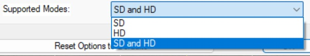
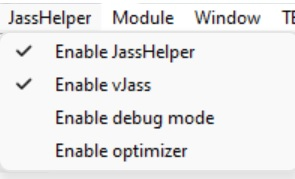

# World of Warcraft Reforged

Open world role-playing game funmap for Warcraft III: Reforged based on [World of Warcraft Reborn](https://www.hiveworkshop.com/threads/world-of-warcraft-reborn.80480/) featuring computer AI support which allows you to play the map offline.
This map is not a recreation of the game World of Warcraft but is inspired by and uses some lore from the game.

Official website: [wowreforged.org](https://wowreforged.org)

## Play the Map

* [Discord Server](https://discord.gg/eM34z36): Join to find players and discuss the map.
* [Official download on Hiveworkshop](https://www.hiveworkshop.com/threads/world-of-warcraft-tsr-1-4.304616/)
* [Official download on Warcraft 3: Reforged - Map database](https://maps.w3reforged.com/maps/categories/role-play-game-rpg/world-of-warcraft-reforged-18-792265)
* [Official download on Epic War](https://www.epicwar.com/maps/331473/)
* [Current development version](./wowr.w3x): Use [this page](https://download-directory.github.io/) with the URL <https://github.com/tdauth/wowr/tree/master/wowr.w3x> to download the directory, open it with the World Editor and save it as a Frozen Throne scenario to play it. It is stored as folder to avoid a big history.

*Enable HD graphics:* The map is restricted to SD graphics to avoid performance issues.
However, you can easily remove this restriction by opening and modifying the map with the World Editor.
Load the map in the World Editor and go to "Scenario" -> "Map Options ..." -> "Supported modes:" -> Choose "SD and HD" -> press OK -> save the map.

Make sure that the JassHelper and vJass are enabled:

## Computer AI

The map uses Warcraft's AI for computer players.
The map contains the modified [common.ai](./wowr.w3x/scripts/common.ai) which is used by all custom AI scripts.

### Warlords

The *.ai files from [war3mapImported](./wowr.w3x/war3mapImported) folder contain a very basic warlord AI for computer players.
Warlord computer players start with a town hall and workers besides their hero.
they will get a new town hall automatically to rebuild their base if the auto respawn is enabled whenever they lose all workers and town halls.
This prevents ending the game for an AI.

### Freelancers

The file [Freelancer.ai](./wowr.w3x/war3mapImported/Freelancer.ai) is imported into the map whenever it is updated.
It contains a very basic freelancer AI for computer players.

### Professions

Every AI is assigned their professions automatically and the crafted items are added to the hero's inventory automatically as well like the hero would craft them.

## Known Reasons for Crashes

Sometimes versions of this map might lead to crashing but since it is really hard to debug Warcraft maps, there are only some possible known reasons for crashes we have experienced so far:

* Missing pathing for buildings constructed by the AI.
* Lower number for maximum number than minimum number of summoned units for Dark Portal based abilities.
* Training of certain unit types by the AI.

## History of the Map

Warcraft III: Reforged is a fun map based on [World of Warcraft Reborn](https://www.hiveworkshop.com/threads/world-of-warcraft-reborn.80480/#resource-3941) which has been created by the users DeMoNiKuS and EvilPitlord.
DeMoNiKuS modified the map World of Warcraft by EvilPitlord.

### Reconstruction

The original map had no trigger data, so all triggers had to be recreated based on the original map script.
The original map script has been added to this repository as well as the original map strings:

* [war3map.j](./original_map/war3map.j)
* [war3map.wts](./translations/war3map.wts)

### Old Versions

**Note:** Some of these versions might have been optimized:

* [wowr3.5.w3x](./wowr3.5.w3x)
* [wowr3.4.w3x](./wowr3.4.w3x)
* [wowr3.3.w3x](./wowr3.3.w3x)
* [wowr3.2.w3x](./wowr3.2.w3x)
* [wowr3.1.w3x](./wowr3.1.w3x)
* [wowr3.0.w3x](./wowr3.0.w3x) (final release after a long time developing on 2.1)
* [wowr2.1.w3x](./wowr2.1.w3x) (development version pre 3.0)
* [wowr2.0.w3x](./wowr2.0.w3x)
* [wowr1.9.9.w3x](./wowr1.9.9.w3x)
* [wowr1.9.8.w3x](./wowr1.9.8.w3x)
* [wowr1.9.7.w3x](./wowr1.9.7.w3x)
* [wowr1.9.6.w3x](./wowr1.9.6.w3x)
* [wowr1.9.5.w3x](./wowr1.9.5.w3x)
* [wowr1.9.4.w3x](./wowr1.9.4.w3x)
* [wowr1.9.3.w3x](./wowr1.9.3.w3x)
* [wowr1.9.2.w3x](./wowr1.9.2.w3x)
* [wowr1.9.1.w3x](./wowr1.9.1.w3x)
* [wowr1.9.0.w3x](./wowr1.9.0.w3x)
* [wowr1.8.9.w3x](./wowr1.8.9.w3x)
* [wowr1.8.8.w3x](./wowr1.8.8.w3x)
* [wowr1.8.7.w3x](./wowr1.8.7.w3x)
* [wowr1.8.6.w3x](./wowr1.8.6.w3x)
* [wowr1.8.5.w3x](./wowr1.8.5.w3x)
* [wowr1.8.4.w3x](./wowr1.8.4.w3x)
* [wowr1.8.3.w3x](./wowr1.8.3.w3x)
* [wowr1.8.2.w3x](./wowr1.8.2.w3x)
* [wowr1.8.1.w3x](./wowr1.8.1.w3x)
* [wowr1.8.w3x](./wowr1.8.w3x)
* [wowr1.7.w3x](./wowr1.7.w3x)
* [wowr1.6.w3x](./wowr1.6.w3x)
* [wowr1.5.w3x](./wowr1.5.w3x)
* [wowr1.4.w3x](./wowr1.4.w3x)
* [wowr1.3.w3x](./wowr1.3.w3x)
* [wowr1.2.w3x](./wowr1.2.w3x)
* [wowr1.1.w3x](./wowr1.1.w3x)

### Other Modified Versions

Look into the folder [original_map_modified](./original_map_modified) where some of the modified versions of the original map are stored.
Here is a list of some modified versions online:

* [World of War in Warcraft 2.03b](https://www.epicwar.com/maps/2673/)
* [World of Warcraft Reborn 2](https://www.epicwar.com/maps/40351/)
* [World of Warcraft 1.8](https://www.epicwar.com/maps/228752)

### Other Variants

Some maps are not really based on the original map World of Warcraft Reborn but a complete revision of the map:

* [WoW Reanimated](https://maps.w3reforged.com/maps/categories/role-play-game-rpg/wow-reanimated): This map has many more dungeons, professions, heroes and races but no AI support and is missing lots of features from this map.

## Credits

* Baradé: Creator.
* EvilPitlord: Original map.
* DeMoNiKuS: Original map.
* Runeblade14: Tests.
* Toasty Toast UwU: Tests.
* Deranor: Tests.
* Axxa's World of Warcraft Logo Creator: Logo.
* Kam, Xaran Alamas, Dmitry Rommel, Tufy: [Gnomish Submarine](https://www.hiveworkshop.com/threads/gnomish-submarine.66130/)
* Scias: [BTNGnomeEngineer](https://www.hiveworkshop.com/threads/btngnomeengineer.310795/)
* PROXY, ~Nightmare: [Sargeras](https://www.hiveworkshop.com/threads/sargeras.294982/)
* LordGandulfo88: [Sargeras](https://www.hiveworkshop.com/threads/sargeras.303195/)
* handclaw, Norinrad: [Day Laborer](https://www.hiveworkshop.com/threads/day-laborer.241876/)
* Burning_Dragoon5: [GoblinTrainingCenter](https://www.hiveworkshop.com/threads/goblintrainingcenter.49900/)
* HerrDave: [Hellscream's Fist](https://www.hiveworkshop.com/threads/hellscreams-fist.332554)
* RightField: [goblin airfield](https://www.hiveworkshop.com/threads/goblin-airfield.49372/)
* skymarshall: [Goblin Fuel Pump](https://www.hiveworkshop.com/threads/goblin-fuel-pump.266762/)
* MiniMage: [Goblin Flame Tank](https://www.hiveworkshop.com/threads/goblin-flame-tank.229089/)
* Burning_Dragoon5: [Goblin altar2](https://www.hiveworkshop.com/threads/goblin-altar2.49899/)
* skymarshall: [Goblin Tower](https://www.hiveworkshop.com/threads/goblin-tower.266461/)
* Mike: [Goblin Emperor](https://www.hiveworkshop.com/threads/goblin-emperor.294291/)
* General Frank: [Goblin Assault Tank 'Gazlowe'](https://www.hiveworkshop.com/threads/goblin-assault-tank-gazlowe.86971/)
* Null: [BTNGoblin Assault Tank 'Gazlowe'](https://www.hiveworkshop.com/threads/btngoblin-assault-tank-gazlowe.326275/)
* Snirou: [Shredder-Flamethrower](https://www.hiveworkshop.com/threads/shredder-flamethrower.325110/)
* induwer: [Goblin Tower](https://www.hiveworkshop.com/threads/goblin-tower.309021/)
* skymarshall, General Frank: [Goblin Outpost](https://www.hiveworkshop.com/threads/goblin-outpost.266280/)
* Kuhneghetz: [Goblin Mage (Variation 1)](https://www.hiveworkshop.com/threads/goblin-mage-variation-1.142634/)
* skymarshall: [Goblin Barracks](https://www.hiveworkshop.com/threads/goblin-barracks.266575/)
* tillinghast: [Goblin sorceress](https://www.hiveworkshop.com/threads/goblin-sorceress.332956/)
* Makuza: [GoblinFireworkerbackup](https://www.hiveworkshop.com/threads/goblinfireworkerbackup.47788/)
* Geries, MiniMage: [GoblinAirDrone](https://www.hiveworkshop.com/threads/goblinairdrone.237875/)
* The_Silent: [Drop Crate (Airdrop)](https://www.hiveworkshop.com/threads/drop-crate-airdrop.324103/)
* Fingolfin: [Parachute](https://www.hiveworkshop.com/threads/parachute.260435/)
* Sellenisko: [GoblinHutNewOneV](https://www.hiveworkshop.com/threads/goblinhutnewonev.163316/)
* Freddyk: [Goblin Bookworm](https://www.hiveworkshop.com/threads/goblin-bookworm.292743/)
* Kuhneghetz: [Female Goblin](https://www.hiveworkshop.com/threads/female-goblin.178045/)
* Blizzard Entertainment, skymarshall: [Goblin Factory](https://www.hiveworkshop.com/threads/goblin-factory.266460/)
* Hayate: [Ogre Goblin Cannon Squad](https://www.hiveworkshop.com/threads/ogre-goblin-cannon-squad.286291/)
* donut3.5: [Goblin Mobile Turret](https://www.hiveworkshop.com/threads/goblin-mobile-turret.48613/)
* donut3.5: [Goblin Steamroller](https://www.hiveworkshop.com/threads/goblin-steamroller.48702/)
* Shardeth: [Gatling Canon](https://www.hiveworkshop.com/threads/gatling-canon.305397/)
* SantoRayo[iP]: [bohrturm](https://www.hiveworkshop.com/threads/bohrturm.49544/)
* 8512590215848: [BTNOilStation](https://www.hiveworkshop.com/threads/btnoilstation.231515/)
* kellym0, MiniMage: [GoblinHammerheadSubmarine](https://www.hiveworkshop.com/threads/goblinhammerheadsubmarine.253628/)
* donut3.5: [Goblin Rocket Rider 2](https://www.hiveworkshop.com/threads/goblin-rocket-rider-2.48352/)
* General Frank: [Goblin Bewm Bewm Tank - The Boomer Retooled](https://www.hiveworkshop.com/threads/goblin-bewm-bewm-tank-the-boomer-retooled.264088/)
* Direfury, KILLCIDE, Mr.Goblin: [Goblin Artist](https://www.hiveworkshop.com/threads/goblin-artist.301848/)
* Marcos DAB: [BTNGoblinFuelSpill](https://www.hiveworkshop.com/threads/btngoblinfuelspill.231355/)
* Eagle XI: [BTNGoblinDerrick](https://www.hiveworkshop.com/threads/btngoblinderrick.271618/)
* NFWar: [BTNAlembic](https://www.hiveworkshop.com/threads/btnalembic.168823/)
* Blizzard Entertainment, Darkfang: [BTNIncome](https://www.hiveworkshop.com/threads/btnincome.256755/)
* FerSZ: [Fel/Shadow Shivarra](https://www.hiveworkshop.com/threads/fel-shadow-shivarra.297940/)
* 67chrome: [BTNShivarraby67chrome](https://www.hiveworkshop.com/threads/btnshivarraby67chrome.193379/)
* Villagerino: [Dwarven Miner (variative)](https://www.hiveworkshop.com/threads/dwarven-miner-variative.334521/)
* Mike: [Mines](https://www.hiveworkshop.com/threads/mines.275791/)
* SeW: [tory3](https://www.hiveworkshop.com/threads/tory3.48970/)
* SeW: [tory2](https://www.hiveworkshop.com/threads/tory2.48971/)
* ossus: [WarWagon](https://www.hiveworkshop.com/threads/warwagon.159507/)
* Direfury: [Dwarven Workers](https://www.hiveworkshop.com/threads/dwarven-workers.252827/)
* Sephiroth_VII: [Dwarven Rail Tank](https://www.hiveworkshop.com/threads/dwarven-rail-tank.133334/)
* Urkdrengi: [Rifleman](https://www.hiveworkshop.com/threads/rifleman.49632/)
* Hayate: [Gryphon](https://www.hiveworkshop.com/threads/gryphon.249076/)
* Tranquil: [Dwarven Rider](https://www.hiveworkshop.com/threads/dwarven-rider.230958/)
* Fuzzyfury: [Dwarven Mining Cart](https://www.hiveworkshop.com/threads/dwarven-mining-cart.250982/)
* Tamplier: [Dwarven Barracks (WOTR style)](https://www.hiveworkshop.com/threads/dwarven-barracks-wotr-style.308471/)
* bakr: [Dwarven Buildings (Bronzebeard)](https://www.hiveworkshop.com/threads/dwarven-buildings-bronzebeard.338590/)
* Ket: [Kurdran Academy](https://www.hiveworkshop.com/threads/kurdran-academy.228176/)
* Tranquil: [Dwarven Battlepriest](https://www.hiveworkshop.com/threads/dwarven-battlepriest.165437/)
* erwtenpeller: [BTNTrollSlayer](https://www.hiveworkshop.com/threads/btntrollslayer.56586/)
* Tranquil: [Hero Geomancer](https://www.hiveworkshop.com/threads/hero-geomancer.199982/)
* GreyArchon: [Dwarven Runecaster](https://www.hiveworkshop.com/threads/dwarven-runecaster.149668/)
* General Frank: [Steam Fortress - The Vapourizer](https://www.hiveworkshop.com/threads/steam-fortress-the-vapourizer.103882/)
* Deolrin, Kwaliti: [Elite Siege Engine - The Übertank](https://www.hiveworkshop.com/threads/elite-siege-engine-the-%C3%9Cbertank.178202/)
* Mr.Goblin: [BTNEliteSeigeTank](https://www.hiveworkshop.com/threads/btneliteseigetank.181170/)
* communist_orc: [Gold Bars](https://www.hiveworkshop.com/threads/gold-bars.90227/)
* The_Silent: [Medieval Wall](https://www.hiveworkshop.com/threads/medieval-wall.336600/)
* Deolrin, ike_ike: [Human Mailbox](https://www.hiveworkshop.com/threads/human-mailbox.159694/)
* Stefan.K: [Hero_Khadgar](https://www.hiveworkshop.com/threads/hero_khadgar.298518/)
* loktar: [Khadgar](https://www.hiveworkshop.com/threads/khadgar.327433/)
* xw1995327www: [Dark Portal <Azeroth>](https://www.hiveworkshop.com/threads/dark-portal-azeroth.338833/)
* Mike: [All types castle (on standart textures)](https://www.hiveworkshop.com/threads/all-types-castle-on-standart-textures.273222/)
* Mr. Bob: [Norse Hall](https://www.hiveworkshop.com/threads/norse-hall.127049/)
* Rhapsodie: [Legends of Arkain - BloodStone Dwarfs](https://www.hiveworkshop.com/threads/legends-of-arkain-bloodstone-dwarfs.338535)
* MatiS: [High Elven Buildings](https://www.hiveworkshop.com/threads/high-elven-buildings.285905/)
* Chen: [RiderlessDragonhawk](https://www.hiveworkshop.com/threads/riderlessdragonhawk.241745/)
* garfield: [RiddenWarEagle](https://www.hiveworkshop.com/threads/riddenwareagle.49258/)
* supertoinkz: [Elven Ranger](https://www.hiveworkshop.com/threads/elven-ranger.181402/)
* Elenai: [ElvenArchCleric](https://www.hiveworkshop.com/threads/elvenarchcleric.48586/)
* bakr: [Elf Village Buildings](https://www.hiveworkshop.com/threads/elf-village-buildings.336692/)
* Cavman, Hawkwing, Mr.Goblin: [High Elf Judicator](https://www.hiveworkshop.com/threads/high-elf-judicator.121803/)
* Em!: [Birdiepult](https://www.hiveworkshop.com/threads/birdiepult.291386/)
* Eagle XI: [BTNStonewall](https://www.hiveworkshop.com/threads/btnstonewall.275743/)
* Darkfang: [Orb of the Sun](https://www.hiveworkshop.com/threads/orb-of-the-sun.288765/)
* General Frank: [Orb of Fire](https://www.hiveworkshop.com/threads/orb-of-fire.106241/)
* Ujimasa Hojo: [Shipyard (Night Elf) and Derivatives](https://www.hiveworkshop.com/threads/shipyard-night-elf-and-derivatives.230445/)
* Retera: [Tiered Temple of Tides (from Heaven's Fall)](https://www.hiveworkshop.com/threads/tiered-temple-of-tides-from-heavens-fall.302776/)
* cleavinghammer: [Coral Golem](https://www.hiveworkshop.com/threads/coral-golem.320084/)
* Retera: [Treasury of the Tides](https://www.hiveworkshop.com/threads/treasury-of-the-tides.302779/)
* Retera: [Pyramid of the Serpent](https://www.hiveworkshop.com/threads/pyramid-of-the-serpent.302773/)
* -Grendel: [Naga Whaler](https://www.hiveworkshop.com/threads/naga-whaler.295123/)
* Villagerino: [Divine Golem (variative)](https://www.hiveworkshop.com/threads/divine-golem-variative.337087/)
* Ujimasa Hojo: [Arcane Observatory and Derivatives](https://www.hiveworkshop.com/threads/arcane-observatory-and-derivatives.224634/)
* Ujimasa Hojo: [Archer (Dragonhawk Mount) and Derivatives](https://www.hiveworkshop.com/threads/archer-dragonhawk-mount-and-derivatives.307950/)
* Jampacked11: [Random Basic](https://www.hiveworkshop.com/threads/random-basic.329922/)
* Lockheart: [Rank 0-5](https://www.hiveworkshop.com/threads/rank-0-5.295070/)
* bakr: [Kultiras Buildings](https://www.hiveworkshop.com/threads/kultiras-buildings.328594/)
* Asssssvi: [Cannoneer Team Kul-Tiras HD/Age of Colonization](https://www.hiveworkshop.com/threads/cannoneer-team-kul-tiras-hd-age-of-colonization.325300/)
* Asssssvi: [Guardsman Kul-Tiras HD](https://www.hiveworkshop.com/threads/guardsman-kul-tiras-hd.322285/)
* Asssssvi: [Flibustier Kul-Tiras HD](https://www.hiveworkshop.com/threads/flibustier-kul-tiras-hd.323044/)
* Explobomb: [Kul Tiras Dreadnought](https://www.hiveworkshop.com/threads/kul-tiras-dreadnought.320777/)
* paulH: [Kul Tiras Sailor](https://www.hiveworkshop.com/threads/kul-tiras-sailor.175324/)
* Explobomb: [Galleon](https://www.hiveworkshop.com/threads/galleon.321779/)
* Cavman: [BTNSailor](https://www.hiveworkshop.com/threads/btnsailor.58624/)
* ViralHatred: [Pirate Battleship (Hexed)](https://www.hiveworkshop.com/threads/pirate-battleship-hexed.48895/)
* Asssssvi: [Rifleman Kul-Tiras HD](https://www.hiveworkshop.com/threads/rifleman-kul-tiras-hd.321942/)
* Asssssvi: [Knight Kul-Tiras HD](https://www.hiveworkshop.com/threads/knight-kul-tiras-hd.321062/)
* Ujimasa Hojo: [Battleship and Derivatives](https://www.hiveworkshop.com/threads/battleship-and-derivatives.246696/)
* Tauer: [Ner'Zhul](https://www.hiveworkshop.com/threads/nerzhul.48865/)
* Tauer: [BTNNerzhul](https://www.hiveworkshop.com/threads/btnnerzhul.58772/)
* Tauer: [Blackhand](https://www.hiveworkshop.com/threads/blackhand.250052/)
* HerrDave, Le Shaysonio: [Roman Infantry Pack](https://www.hiveworkshop.com/threads/roman-infantry-pack.337048/)
* Raging Ent: [BTNRomanHelmet](https://www.hiveworkshop.com/threads/btnromanhelmet.188728/)
* purparisien: [Circus Maximus](https://www.hiveworkshop.com/threads/circus-maximus.320326/)
* purparisien: [Coliseum](https://www.hiveworkshop.com/threads/coliseum.319855/)
* Miseracord: [Gladiator-Miseracord](https://www.hiveworkshop.com/threads/gladiator-miseracord.49833/)
* Kuhneghetz: [Lion Female (aka Lioness)](https://www.hiveworkshop.com/threads/lion-female-aka-lioness.92915/)
* Kuhneghetz: [Lion Male](https://www.hiveworkshop.com/threads/lion-male.92916/)
* Kuhneghetz: [BTNLionFemale](https://www.hiveworkshop.com/threads/btnlionfemale.58861/)
* Kuhneghetz: [BTNLionMale](https://www.hiveworkshop.com/threads/btnlionmale.58860/)
* Kuhneghetz: [Roman Villa](https://www.hiveworkshop.com/threads/roman-villa.48323/)
* GolluM_KoMe, olofmoleman, purparisien: [Ancient Ships](https://www.hiveworkshop.com/threads/ancient-ships.319180/)
* Tykkimies: [Temppeli skinillalowpoly](https://www.hiveworkshop.com/threads/temppeli-skinillalowpoly.49727/)
* !!GORO!!: [Tower1](https://www.hiveworkshop.com/threads/tower1.49722/)
* Kwaliti: [Deathwing](https://www.hiveworkshop.com/threads/deathwing.200374/)
* XenoStalker: [BTNDeathwing](https://www.hiveworkshop.com/threads/btndeathwing.186057/)
* Mc!: [FireElementalByMc](https://www.hiveworkshop.com/threads/fireelementalbymc.47638/)
* Blizzard Entertainment: [Fire Elemental](https://www.hiveworkshop.com/threads/fire-elemental.307530/)
* Explobomb: [Old God Pack](https://www.hiveworkshop.com/threads/old-god-pack.334166/)
* CRAZYRUSSIAN: [BTN_CR_Heart_of_Gold](https://www.hiveworkshop.com/threads/btn_cr_heart_of_gold.58148/)
* ikillforeyou: [Goblin War Zeppelin](https://www.hiveworkshop.com/threads/goblin-war-zeppelin.162935/)
* Shardeth: [Net Launcher Turret](https://www.hiveworkshop.com/threads/net-launcher-turret.330923/)
* ILH: [Nuclear Silo and Missile](https://www.hiveworkshop.com/threads/nuclear-silo-and-missile.298792/)
* Callahan: [The Void Lord](https://www.hiveworkshop.com/threads/the-void-lord.48554/)
* Anitarf: [Arrow Key System](http://www.wc3c.net/showthread.php?t=101271)
* Opossum: [Third Person Camera System](http://www.wc3c.net/showthread.php?t=104786)
* Remixer: [Pandarian Harvester](https://www.hiveworkshop.com/threads/pandarian-harvester.316782/)
* PROXY: [PandarenTemple01](https://www.hiveworkshop.com/threads/pandarentemple01.220886/)
* PROXY: [HeroGoblinGunner](https://www.hiveworkshop.com/threads/herogoblingunner.227827/)
* Tiberius_XXVII: [BTNGobGunner](https://www.hiveworkshop.com/threads/btngobgunner.56665/)
* UgoUgo: [BTNBShipCannon1](https://www.hiveworkshop.com/threads/btnbshipcannon1.245647/)
* Sylvie: [BTNCannonIcon](https://www.hiveworkshop.com/threads/btncannonicon.261384/)
* UgoUgo: [Bamboo](https://www.hiveworkshop.com/threads/bamboo.233143/)
* Asssssvi: [Ship's Doctor Kul-Tiras HD](https://www.hiveworkshop.com/threads/ships-doctor-kul-tiras-hd.324634/)
* Asssssvi: [Storm Sorcerer Kul-Tiras HD](https://www.hiveworkshop.com/threads/storm-sorcerer-kul-tiras-hd.324722/)
* 𝓚𝓪𝓭𝓸𝓿𝓲𝓨𝓲ツ: [BTNAltar of Eternity](https://www.hiveworkshop.com/threads/btnaltar-of-eternity.335872/)
* 𝓚𝓪𝓭𝓸𝓿𝓲𝓨𝓲ツ: [BTNHighElf Sanctuary](https://www.hiveworkshop.com/threads/btnhighelf-sanctuary.335875/)
* 𝓚𝓪𝓭𝓸𝓿𝓲𝓨𝓲ツ: [BTNHighElf Sanctuary1](https://www.hiveworkshop.com/threads/btnhighelf-sanctuary1.335876/)
* 𝓚𝓪𝓭𝓸𝓿𝓲𝓨𝓲ツ: [BTNHighElf Sanctuary2](https://www.hiveworkshop.com/threads/btnhighelf-sanctuary2.335877/)
* Remixer: [Pandarian Sanctuary (Advanced Research Center)](https://www.hiveworkshop.com/threads/pandarian-sanctuary-advanced-research-center.308296/)
* Remixer: [Pandarian Shelter](https://www.hiveworkshop.com/threads/pandarian-shelter.308292/)
* Blizzard Entertainment, 𝓚𝓪𝓭𝓸𝓿𝓲𝓨𝓲ツ: [Lordaeron Summer Doodads](https://www.hiveworkshop.com/threads/lordaeron-summer-doodads.338175/)
* Solu9: [BTNSimpleCompass12](https://www.hiveworkshop.com/threads/btnsimplecompass12.254423/)
* NFWar: [BTNPieceOfShip](https://www.hiveworkshop.com/threads/btnpieceofship.176222/)
* raft_pl: [BTNGate](https://www.hiveworkshop.com/threads/btngate.58423/)
* raft_pl: [BTNGateOpened](https://www.hiveworkshop.com/threads/btngateopened.58424/)
* Bribe: [Snippet Ascii](https://www.hiveworkshop.com/threads/snippet-ascii.190746/)
* TriggerHappy: [FileIO](https://www.hiveworkshop.com/threads/fileio.307568/)
* Wildfire: [Torch](https://www.hiveworkshop.com/threads/torch.306664/)
* Explobomb: [Fel Reaver](https://www.hiveworkshop.com/threads/fel-reaver.325698/)
* Mr. Bob: [Library](https://www.hiveworkshop.com/threads/library.135790/)
* Missing Shadowsong, YourArthas, Zorrot: [Elune The Night Goddess](https://www.hiveworkshop.com/threads/elune-the-night-goddess.339911/)
* Vensedouh: [Elune's Vision](https://www.hiveworkshop.com/threads/elunes-vision.329082/)
* Alethos: [Envoy of the Goddess / Vicaress of Elune](https://www.hiveworkshop.com/threads/envoy-of-the-goddess-vicaress-of-elune.303229/)
* Blizzard Entertainment: [BTNINV_Misc_Bag_09](https://www.hiveworkshop.com/threads/btninv_misc_bag_09.55166/)
* Direfury: [†-Revellion-†'s Goblin Engineer](https://www.hiveworkshop.com/threads/%E2%80%A0-revellion-%E2%80%A0s-goblin-engineer.135478/)
* Dangerb0y: [Easy Item Stack 'n Split v2.7.4](https://www.hiveworkshop.com/threads/easy-item-stack-n-split-v2-7-4.153287/) as reference for the unstack and pickup item systems.
* MeKC: [GetItemValue](https://www.hiveworkshop.com/threads/detecting-item-price.120355/#post-1045229) as reference for item gold and lumber value system.
* Ergius: [IronOre](https://www.hiveworkshop.com/threads/ironore.90713/)
* Ergius: [SilverOre](https://www.hiveworkshop.com/threads/silverore.90710/)
* Ergius: [GoldOre](https://www.hiveworkshop.com/threads/goldore.90703/)
* Blizzard Entertainment: [BTNINV_Ore_Iron_01](https://www.hiveworkshop.com/threads/btninv_ore_iron_01.54864/)
* Blizzard Entertainment: [BTNINV_Ore_Mithril_01](https://www.hiveworkshop.com/threads/btninv_ore_mithril_01.54863/)
* Blizzard Entertainment: [BTNINV_Ore_Copper_01](https://www.hiveworkshop.com/threads/btninv_ore_copper_01.54865/)
* KelThuzad: [BTNGoldBar](https://www.hiveworkshop.com/threads/btngoldbar.110288/)
* Kwaliti: [Jedi](https://www.hiveworkshop.com/threads/jedi.108826/)
* olofmoleman: [JediStarfighter](https://www.hiveworkshop.com/threads/jedistarfighter.50180/)
* HerrDave: [Star Wars - Darth Vader](https://www.hiveworkshop.com/threads/star-wars-darth-vader.292509/)
* HerrDave: [Star Wars - Stormtrooper Pack](https://www.hiveworkshop.com/threads/star-wars-stormtrooper-pack.331491/)
* Tim.: [Tie](https://www.hiveworkshop.com/threads/tie.49703/)
* olofmoleman: [BTNDarthVader](https://www.hiveworkshop.com/threads/btndarthvader.56698/)
* olofmoleman: [Marine](https://www.hiveworkshop.com/threads/marine.49802/)
* Fingolfin: [Fingolfins Separatist Fleet Pack](https://www.hiveworkshop.com/threads/fingolfins-separatist-fleet-pack.264210/)
* olofmoleman: [Geonosian](https://www.hiveworkshop.com/threads/geonosian.49785/)
* Illidan(Evil)X: [Imperial Shuttle](https://www.hiveworkshop.com/threads/imperial-shuttle.50239/)
* Kwaliti: [Jedi](https://www.hiveworkshop.com/threads/jedi.108826/)
* olofmoleman, Yoda: [Yoda](https://www.hiveworkshop.com/threads/yoda.49775/)
* Illidan(Evil)X: [Jedi Starfighter](https://www.hiveworkshop.com/threads/jedi-starfighter.50203/)
* GreyArchon: [Bamboo Doodad 1](https://www.hiveworkshop.com/threads/bamboo-doodad-1.49756/)
* GreyArchon: [Bamboo Doodad 2](https://www.hiveworkshop.com/threads/bamboo-doodad-2.49757/)
* Illidan(Evil)X: [LightSaber3D](https://www.hiveworkshop.com/threads/lightsaber3d.49843/)
* olofmoleman: [BTNLightSaberMW](https://www.hiveworkshop.com/threads/btnlightsabermw.56777/)
* Mc !: [Laser](https://www.hiveworkshop.com/threads/laser.47871/)
* olofmoleman: [Droideka](https://www.hiveworkshop.com/threads/droideka.50059/)
* olofmoleman: [Rancor](https://www.hiveworkshop.com/threads/rancor.49850/)
* olofmoleman: [TuskenRaider](https://www.hiveworkshop.com/threads/tuskenraider.50190/)
* Fingolfin: [Multi Troop Transport](https://www.hiveworkshop.com/threads/multi-troop-transport.263953/)
* olofmoleman: [Hail Fire Droid](https://www.hiveworkshop.com/threads/hail-fire-droid.50017/)
* olofmoleman: [Super Battle Droid](https://www.hiveworkshop.com/threads/super-battle-droid.48313/)
* olofmoleman: [Dwarf Spider Droid](https://www.hiveworkshop.com/threads/dwarf-spider-droid.47726/)
* olofmoleman: [DroidStarFighter](https://www.hiveworkshop.com/threads/droidstarfighter.49834/)
* olofmoleman: [TechnoUnionShip](https://www.hiveworkshop.com/threads/technounionship.50495/)
* olofmoleman: [Aat](https://www.hiveworkshop.com/threads/aat.50055/)
* olofmoleman: [DarthRevan](https://www.hiveworkshop.com/threads/darthrevan.47910/)
* Mechanical Man: [Star wars Clone war vehicles](https://www.hiveworkshop.com/threads/star-wars-clone-war-vehicles.290428/)
* Illidan(Evil)X: [Death Star (high-res) IngameSkin](https://www.hiveworkshop.com/threads/death-star-high-res-ingameskin.50323/)
* Illidan(Evil)X: [DBLightsaber3D](https://www.hiveworkshop.com/threads/dblightsaber3d.49844/)
* Illidan(Evil)X: [LightSaberHilt](https://www.hiveworkshop.com/threads/lightsaberhilt.49825/)
* Illidan(Evil)X: [ObiWans Lightsaber RotS](https://www.hiveworkshop.com/threads/obiwans-lightsaber-rots.50230/)
* Rolo: [Factory](https://www.hiveworkshop.com/threads/factory.311932/)
* Nasrudin: [Jedi](https://www.hiveworkshop.com/threads/jedi.50599/)
* Wojannnn: [Star Wars Sith pack](https://wc3modding.info/6439/star-wars-sith-pack/)
* Jack_Sparrow93: [BTNGreenLightsaber](https://www.hiveworkshop.com/threads/btngreenlightsaber.157824/)
* Jack_Sparrow93: [BTNRedLightsaber4](https://www.hiveworkshop.com/threads/btnredlightsaber4.156322/)
* olofmoleman: [BTNLightsaberBlock](https://www.hiveworkshop.com/threads/btnlightsaberblock.56759/)
* purparisien: [Ancient Shipyard](https://www.hiveworkshop.com/threads/ancient-shipyard.321677/)
* Fingolfin: [Acclamator Class Assault Ship](https://www.hiveworkshop.com/threads/acclamator-class-assault-ship.258696/)
* olofmoleman: [Gungan](https://www.hiveworkshop.com/threads/gungan.50184/)
* Illidan(Evil)X: [NabooBuilding02](https://www.hiveworkshop.com/threads/naboobuilding02.50234/)
* olofmoleman: [NabooStarFighter](https://www.hiveworkshop.com/threads/naboostarfighter.50018/)
* olofmoleman: [Marine](https://www.hiveworkshop.com/threads/marine.49801/)
* olofmoleman: [BTNCloneTrooper](https://www.hiveworkshop.com/threads/btnclonetrooper.56669/)
* Fingolfin: [Republic Gunship](https://www.hiveworkshop.com/threads/republic-gunship.273820/)
* olofmoleman: [Marine](https://www.hiveworkshop.com/threads/marine.47718/)
* olofmoleman: [Turbolazer](https://www.hiveworkshop.com/threads/turbolazer.50174/)
* Fingolfin: [All Terrain Attack Pod](https://www.hiveworkshop.com/threads/all-terrain-attack-pod.264425/)
* Fingolfin: [V-Wing Fighter/Bomber](https://www.hiveworkshop.com/threads/v-wing-fighter-bomber.265593/)
* Fingolfin: [Consular-class Cruiser](https://www.hiveworkshop.com/threads/consular-class-cruiser.271794/)
* Fingolfin: [Coruscant](https://www.hiveworkshop.com/threads/coruscant.250027/)
* olofmoleman: [Ewok](https://www.hiveworkshop.com/threads/ewok.50259/)
* olofmoleman: [Kaminoan](https://www.hiveworkshop.com/threads/kaminoan.50196/)
* olofmoleman: [BanthawithRider](https://www.hiveworkshop.com/threads/banthawithrider.50229/)
* olofmoleman: [ArcTrooper](https://www.hiveworkshop.com/threads/arctrooper.50165/)
* Illidan(Evil)X: [Arc - 170](https://www.hiveworkshop.com/threads/arc-170.50198/)
* RightField: [laser](https://www.hiveworkshop.com/threads/laser.47521/)
* olofmoleman: [Gran](https://www.hiveworkshop.com/threads/gran.50238/)
* Kricz: [Knockback v1.01b](https://www.hiveworkshop.com/threads/knockback-v1-01b.174502/)
* Jab1z: [Zeus Lord of Olympus](https://www.hiveworkshop.com/threads/zeus-lord-of-olympus.341085/)
* purparisien: [Ancient Barracks](https://www.hiveworkshop.com/threads/ancient-barracks.321483/)
* Fingolfin: [Roman Heavy Cavalry](https://www.hiveworkshop.com/threads/roman-heavy-cavalry.339258/)
* Maker: [Jump System v. 1.0.1.6](https://www.hiveworkshop.com/threads/jump-system-v-1-0-1-6.230294/)
* bakr: [Assorted Farm Buildings](https://www.hiveworkshop.com/threads/assorted-farm-buildings.336611/)
* bakr: [Kultiras Structures and Doodads](https://www.hiveworkshop.com/threads/kultiras-structures-and-doodads.338876/)
* RightField: [Branch](https://www.hiveworkshop.com/threads/branch.49481/)
* Mephestrial: [Gan'arg Engineer](https://www.hiveworkshop.com/threads/ganarg-engineer.158134/)
* Explobomb: [Core Hound](https://www.hiveworkshop.com/threads/core-hound.331564/)
* Murlocologist: [Ragnaros](https://www.hiveworkshop.com/threads/ragnaros.318737/)
* Murlocologist: [Ragnaros](https://www.hiveworkshop.com/threads/ragnaros.326594/)
* The Panda: [BTNBlastHammer](https://www.hiveworkshop.com/threads/btnblasthammer.327759/)
* Murlocologist: [Ashbringer](https://www.hiveworkshop.com/threads/ashbringer.328960/)
* Eagle XI: [Goblin Building Icons](https://www.hiveworkshop.com/threads/goblin-building-icons.275807/)
* Ceterai: [BTNGoblinTower](https://www.hiveworkshop.com/threads/btngoblintower.332439/)
* Darkfang: [Mage Orb](https://www.hiveworkshop.com/threads/mage-orb.288271/)
* lelyanra: [BTNDigArtifact](https://www.hiveworkshop.com/threads/btndigartifact.164559/)
* Blizzard Entertainment: [BTNAbility_Hunter_BeastCall](https://www.hiveworkshop.com/threads/btnability_hunter_beastcall.55496/)
* Mike: [Turret](https://www.hiveworkshop.com/threads/turret.266656/)
* Blizzard Entertainment: [BTNINV_Misc_Bag_10](https://www.hiveworkshop.com/threads/btninv_misc_bag_10.55161/)
* johnwar: [Troll Gatherer](https://www.hiveworkshop.com/threads/troll-gatherer.334513/)
* Chucky: [Troll Hall Tiered](https://www.hiveworkshop.com/threads/troll-hall-tiered.332981/)
* Just_Spectating: [Villager Troll2.0](https://www.hiveworkshop.com/threads/villager-troll2-0.176602/)
* -Grendel: [Troll Manhunter (Pack)](https://www.hiveworkshop.com/threads/troll-manhunter-pack.341307/)
* Em!: [Giant Bat](https://www.hiveworkshop.com/threads/giant-bat.307985/)
* Jaccouille: [Blood Troll Mage](https://www.hiveworkshop.com/threads/blood-troll-mage.326962/)
* johnwar: [Troll Hexer](https://www.hiveworkshop.com/threads/troll-hexer.335128/)
* bakr: [Tauren Buildings](https://www.hiveworkshop.com/threads/tauren-buildings.328637/)
* apaka: [Tauren Worker](https://www.hiveworkshop.com/threads/tauren-worker.92627/)
* Cavman: [Forest Troll Female](https://www.hiveworkshop.com/threads/forest-troll-female.104295/)
* Deolrin: [Jungle Troll - Altar of Blood](https://www.hiveworkshop.com/threads/jungle-troll-altar-of-blood.126964/)
* Ujimasa Hojo: [Shipyard (Undead) and Derivatives](https://www.hiveworkshop.com/threads/shipyard-undead-and-derivatives.225668/)
* The Panda: [BTNWindOrb](https://www.hiveworkshop.com/threads/btnwindorb.308033/)
* warhog: [BTNLantern](https://www.hiveworkshop.com/threads/btnlantern.176526/)
* Cynon_Ironsmith: [BTNEyeOfDalaran](https://www.hiveworkshop.com/threads/btneyeofdalaran.56242/)
* Ujimasa Hojo: [Granary and Derivatives](https://www.hiveworkshop.com/threads/granary-and-derivatives.287993/)
* Sin'dorei300: [Blood Elf Villager](https://www.hiveworkshop.com/threads/blood-elf-villager.266684/)
* Sin'dorei300: [Night Elf Villager](https://www.hiveworkshop.com/threads/night-elf-villager.266203/)
* General Frank: [Chaos: Altar of Terror](https://www.hiveworkshop.com/threads/chaos-altar-of-terror.48265/)
* Vinz: [Cosmic Elven Wings](https://www.hiveworkshop.com/threads/cosmic-elven-wings.315167/)
* Paladon: [BTNPAngelWings](https://www.hiveworkshop.com/threads/btnpangelwings.139269/)
* icewolf055, MiniMage: [SandElemental](https://www.hiveworkshop.com/threads/sandelemental.244919/)
* exN: [BTNSand](https://www.hiveworkshop.com/threads/btnsand.55669/)
* Ujimasa Hojo: [Sacrificial Altar and Derivarives](https://www.hiveworkshop.com/threads/sacrificial-altar-and-derivarives.248050/)
* Wandering Soul: [Pikeman](https://www.hiveworkshop.com/threads/pikeman.221645/)
* Kitabatake: [Fire Mage](https://www.hiveworkshop.com/threads/fire-mage.165394/)
* acolyteofdoom: [HeroArchMage](https://www.hiveworkshop.com/threads/heroarchmage.49732/)
* Tarrasque, General Frank: [Lightning Elemental](https://www.hiveworkshop.com/threads/lightning-elemental.99584/)
* Tarrasque: [Naked Lightning Elemental](https://www.hiveworkshop.com/threads/naked-lightning-elemental.191566/)
* alfredx_sotn: [AirElemental](https://www.hiveworkshop.com/threads/airelemental.49342/)
* Mc !: [FrostElemental](https://www.hiveworkshop.com/threads/frostelemental.49502/)
* icewolf055: [Poison Elemental](https://www.hiveworkshop.com/threads/poison-elemental.310391/)
* jigrael: [BTNLightingElemental](https://www.hiveworkshop.com/threads/btnlightingelemental.107240/)
* Darkfang: [Elemental Convergence](https://www.hiveworkshop.com/threads/elemental-convergence.337666/)
* Ujimasa Hojo: [Gold Mine and Derivatives](https://www.hiveworkshop.com/threads/gold-mine-and-derivatives.245385/)
* Vexorian: [SimError](http://www.wc3c.net/showthread.php?t=101260)
* Henry_AC: [BTNPowerGenerator with different colors](https://www.hiveworkshop.com/threads/btnpowergenerator-with-different-colors.342387/)
* JollyD: [BTNLightingElemental](https://www.hiveworkshop.com/threads/btnlightingelemental.220839/)
* BoatyMcBoatface300: [Villager Kazotsky Kick Dance](https://www.hiveworkshop.com/threads/villager-kazotsky-kick-dance.326330/)
* -Grendel: [Void Walker](https://www.hiveworkshop.com/threads/void-walker.270358/)
* Vinz: [Void Rain](https://www.hiveworkshop.com/threads/void-rain.316011/)
* Vinz: [Void Disc](https://www.hiveworkshop.com/threads/void-disc.315937/)
* Eldin HawkWing: [BTNArcaneVoid](https://www.hiveworkshop.com/threads/btnarcanevoid.277879/)
* CRAZYRUSSIAN: [BTNBK_Blue_Book](https://www.hiveworkshop.com/threads/btnbk_blue_book.57364/)
* Remixer: [Pandarian Elemental Shrine](https://www.hiveworkshop.com/threads/pandarian-elemental-shrine.312368/)
* Athur12A2: [Wooden Bridges](https://www.hiveworkshop.com/threads/wooden-bridges.292602/)
* Skipper: [FireworkTeam](https://www.hiveworkshop.com/threads/fireworkteam.202942/)
* Coinblin: [BTNFirework](https://www.hiveworkshop.com/threads/btnfirework.138265/)
* PROXY: [Pandaren Sage](https://www.hiveworkshop.com/threads/pandaren-sage.340032/)
* Remixer: [Pandarian Hall of Elements](https://www.hiveworkshop.com/threads/pandarian-hall-of-elements.308294/)
* Remixer: [Pandarian Storm Spire](https://www.hiveworkshop.com/threads/pandarian-storm-spire.312366/)
* Norinrad: [Pandaren Nurse by Norinrad](https://www.hiveworkshop.com/threads/pandaren-nurse-by-norinrad.47644/)
* General Frank: [Pandaren Villager](https://www.hiveworkshop.com/threads/pandaren-villager.134720/)
* Mr.Goblin: [BTNPandaVillager](https://www.hiveworkshop.com/threads/btnpandavillager.134875/)
* killst4r: [Pandaren Building2](https://www.hiveworkshop.com/threads/pandaren-building2.49753/)
* Stefan.K: [Pandaren Warlord](https://www.hiveworkshop.com/threads/pandaren-warlord.308836/)
* Mephestrial: [LegionTeleporter](https://www.hiveworkshop.com/threads/legionteleporter.167395/)
* Vinz: [Eldritch Covenant](https://www.hiveworkshop.com/threads/eldritch-covenant.328093/)
* FerSZ: [Jailer](https://www.hiveworkshop.com/threads/jailer.290533/)
* Alexen: [Jailer. Base + Blue + Red](https://www.hiveworkshop.com/threads/jailer-base-blue-red.325185/)
* FerSZ: [Inquisitor](https://www.hiveworkshop.com/threads/inquisitor.292820/)
* The_Silent: [BTNCinematicLever](https://www.hiveworkshop.com/threads/btncinematiclever.273831/)
* Blizzard Entertainment: [BTNINV_Misc_Rock_01](https://www.hiveworkshop.com/threads/btninv_misc_rock_01.54883/)
* prizraknadache: [BTNsteelcage](https://www.hiveworkshop.com/threads/btnsteelcage.277908/)
* Blizzard Entertainment, Xetanth87: [BTNEntangledGoldMine](https://www.hiveworkshop.com/threads/btnentangledgoldmine.336786/)
* bakr: [Assorted City Buildings](https://www.hiveworkshop.com/threads/assorted-city-buildings.336823/)
* Blizzard Entertainment, genin32: [BTNMurlocHut1](https://www.hiveworkshop.com/threads/btnmurlochut1.251635/)
* Ziadoma: [Jedi Drone](https://www.hiveworkshop.com/threads/jedi-drone.341054/)
* PrMosquito: [ManaWard](https://www.hiveworkshop.com/threads/manaward.50073/)
* RightField: [webward](https://www.hiveworkshop.com/threads/webward.49471/)
* Uncle Fester: [MinigunTower](https://www.hiveworkshop.com/threads/miniguntower.224871/)
* Eagle XI: [Highelf Building Icons](https://www.hiveworkshop.com/threads/highelf-building-icons.291719/)
* Eagle XI: [BTNBlueDragonNexus](https://www.hiveworkshop.com/threads/btnbluedragonnexus.291697/)
* Hantoo: [Santa Claus](https://www.hiveworkshop.com/threads/santa-claus.273859/)
* Hantoo, HerrDave: [Santa Claus 2017](https://www.hiveworkshop.com/threads/santa-claus-2017.301777/)
* Vinz: [Christmas Tree](https://www.hiveworkshop.com/threads/christmas-tree.337019/)
* Jaccouille: [Reindeer](https://www.hiveworkshop.com/threads/reindeer.329664/)
* JollyD: [BTNGiftHive](https://www.hiveworkshop.com/threads/btngifthive.227947/)
* Mc !: [Present](https://www.hiveworkshop.com/threads/present.49772/)
* Thrikodius: [Frosty the Snowman](https://www.hiveworkshop.com/threads/frosty-the-snowman.119803/)
* infrenus: [Bascinet Knights](https://www.hiveworkshop.com/threads/bascinet-knights.311845/)
* Mike: [All types castle](https://www.hiveworkshop.com/threads/all-types-castle.263665/)
* Mr. Bob: [Medieval Buildings: The complete collection.](https://www.hiveworkshop.com/threads/medieval-buildings-the-complete-collection.157245/)
* Vendro the Wind Mage: [Naga Queen Azshara SD](https://www.hiveworkshop.com/threads/queen-azshara-sd.344213/#post-3557050)
* PrinceYaser: [Queen Azshara](https://www.hiveworkshop.com/threads/queen-azshara.303895/)
* Eagle XI: [Siegemachinery Icons](https://www.hiveworkshop.com/threads/siegemachinery-icons.275804/)
* Mike: [Siege Tower](https://www.hiveworkshop.com/threads/siege-tower.265285/)
* Eagle XI: [Medieval Building Icons](https://www.hiveworkshop.com/threads/medieval-building-icons.275805/)
* Mike: [Medieval castle](https://www.hiveworkshop.com/threads/medieval-castle.258799/)
* purparisien: [BTNladder](https://www.hiveworkshop.com/threads/siege-ladder.331605/#post-3476647)
* MassiveMaster: [Siege Ladder](https://www.hiveworkshop.com/threads/siege-ladder.217560/)
* Hayate and, Mike: [PackedTrebuchet](https://www.hiveworkshop.com/threads/packedtrebuchet.265643/)
* PROXY: [Pandaren Archer](https://www.hiveworkshop.com/threads/pandaren-archer.340008/)
* PROXY: [Pandaren Honorguard](https://www.hiveworkshop.com/threads/pandaren-honorguard.340010/)
* PROXY: [Hero Shado Pan](https://www.hiveworkshop.com/threads/hero-shado-pan.340012/)
* PROXY: [Hero Iron Fist](https://www.hiveworkshop.com/threads/hero-iron-fist.340014/)
* PrinceYaser: [BTNMedievalHelmet](https://www.hiveworkshop.com/threads/btnmedievalhelmet.317929/)
* Mike: [Marketplace](https://www.hiveworkshop.com/threads/marketplace.239967/)
* Mike: [Marketplace](https://www.hiveworkshop.com/threads/marketplace.275099/)
* Eagle XI: [BTNMarket](https://www.hiveworkshop.com/threads/btnmarket.291533/)
* Blizzard Entertainment: [Neutral Building - Thieves Guild (Beta)](https://www.hiveworkshop.com/threads/neutral-building-thieves-guild-beta.246769/)
* MiniMage: [Goblin Trade Prince Mech Hero](https://www.hiveworkshop.com/threads/goblin-trade-prince-mech-hero.301992/)
* Scias: [BTNGoblinPrince](https://www.hiveworkshop.com/threads/btngoblinprince.302515/)
* xyzier_24: [VoidSkullAura_v5](https://www.hiveworkshop.com/threads/voidskullaura_v5.249731/)
* Mike: [University](https://www.hiveworkshop.com/threads/university.276219/)
* Mike: [Towers](https://www.hiveworkshop.com/threads/towers.273887/)
* Graber: [Villager 255 Animations](https://www.hiveworkshop.com/threads/villager-255-animations.192204/)
* The Panda: [BTNSimpleBow](https://www.hiveworkshop.com/threads/btnsimplebow.261424/)
* Uncle Fester: [CheapStandardBow](https://www.hiveworkshop.com/threads/cheapstandardbow.243123/)
* Mike: [Catapult](https://www.hiveworkshop.com/threads/catapult.264564/)
* Mike: [Bombard](https://www.hiveworkshop.com/threads/bombard.264778/)
* Eagle XI: [BTNBuildableCathedral](https://www.hiveworkshop.com/threads/btnbuildablecathedral.271632/)
* takakenji: [TCCathedral](https://www.hiveworkshop.com/threads/tccathedral.158137/)
* Darkfang: [Bishop](https://www.hiveworkshop.com/threads/bishop.338075/)
* Tranquil: [Human Bishop](https://www.hiveworkshop.com/threads/human-bishop.254630/)
* Mike: [Organ cannon](https://www.hiveworkshop.com/threads/organ-cannon.264823/)
* Ket: [Monk](https://www.hiveworkshop.com/threads/monk.50657/)
* Eagle XI: [BTNBatteringRam](https://www.hiveworkshop.com/threads/btnbatteringram.271777/)
* Mechanical Man: [Battering ram](https://www.hiveworkshop.com/threads/battering-ram.50758/)
* Mike: [Mantlet](https://www.hiveworkshop.com/threads/mantlet.244821/)
* IamMclovin: [Human Wizard](https://www.hiveworkshop.com/threads/human-wizard.48909/)
* Hemske: [BTNWizardHat](https://www.hiveworkshop.com/threads/btnwizardhat.257780/)
* Explobomb: [Battle Elephant](https://www.hiveworkshop.com/threads/battle-elephant.320783/)
* Em!: [Petard](https://www.hiveworkshop.com/threads/petard.212674/)
* Miseracord: [Crusader-Miseracord](https://www.hiveworkshop.com/threads/crusader-miseracord.47821/)
* Mike: [Tents](https://www.hiveworkshop.com/threads/tents.275471/)
* Mike: [Pier](https://www.hiveworkshop.com/threads/pier.239819/)
* Mike: [RoyalOrb](https://www.hiveworkshop.com/threads/royalorb.244368/)
* Mike: [Wagon](https://www.hiveworkshop.com/threads/wagon.250916/)
* expresso, Tranquil: [Angel](https://www.hiveworkshop.com/threads/angel.65292/)
* Mike: [Chalice](https://www.hiveworkshop.com/threads/chalice.244829/)
* CRAZYRUSSIAN: [BTNHL_Holy_Grail](https://www.hiveworkshop.com/threads/btnhl_holy_grail.57330/)
* Asssssvi: [Footman Kul-Tiras HD](https://www.hiveworkshop.com/threads/footman-kul-tiras-hd.319578/)
* Asssssvi: [Royal Guard Kul-Tiras HD](https://www.hiveworkshop.com/threads/royal-guard-kul-tiras-hd.322373/)
* Hellx-Magnus: [BTNSpectralHead](https://www.hiveworkshop.com/threads/btnspectralhead.170421/)
* HerrDave: [Skyfire Gunship](https://www.hiveworkshop.com/threads/skyfire-gunship.272359/)
* Eagle XI: [BTNSkyfireGunship.blp](https://www.hiveworkshop.com/threads/btnskyfiregunship-blp.285491/)
* Null: [BTNKul Tiras Defend](https://www.hiveworkshop.com/threads/btnkul-tiras-defend.320275/)
* supertoinkz: [Gnome Ark](https://www.hiveworkshop.com/threads/gnome-ark.159515/)
* Эльрат: [AT-RT](https://xgm.guru/p/wc3/atrt)
* Bloody_Turds: [Naga Dragon](https://www.hiveworkshop.com/threads/naga-dragon.144931/)
* olofmoleman: [PeregrinFalcon](https://www.hiveworkshop.com/threads/peregrinfalcon.49888/)
* Cavman: [Kul'Tiras Sailor](https://www.hiveworkshop.com/threads/kultiras-sailor.48685/)
* Fingolfin: [Wheat Field](https://www.hiveworkshop.com/threads/wheat-field.307321/)
* Alethos: [Old Witch](https://www.hiveworkshop.com/threads/old-witch.300931/)
* Asssssvi, Xelos: [KultirasSiegeLandship](https://www.hiveworkshop.com/threads/kultiras-race.324597/)
* Oren neu dag: [Pirate_Flag](https://en.wikipedia.org/wiki/File:Pirate_Flag.svg), [Hive Upload](https://www.hiveworkshop.com/threads/pirate-flag.346391/)
* ikillforeyou: [Horde Crossbow](https://www.hiveworkshop.com/threads/horde-crossbow.150585/)
* Blizzard Entertainment: [BTNINV_Weapon_Crossbow_04](https://www.hiveworkshop.com/threads/btninv_weapon_crossbow_04.54751/)
* HerrDave: [Villager Cavalier Weaponless (Mike)](https://www.hiveworkshop.com/threads/villager-cavalier-weaponless-mike.276643/)
* ikillforeyou: [Crusader Helm](https://www.hiveworkshop.com/threads/crusader-helm.138849/)
* Sunchips: [Mail Armor](https://www.hiveworkshop.com/threads/mail-armor.170743/)
* Usedwell: [Lance of Honor](https://www.hiveworkshop.com/threads/lance-of-honor.160758/)
* Usedwell: [Lance of Honor](https://www.hiveworkshop.com/threads/lance-of-honor.160758)
* GooS: [BTNImprovedLance](https://www.hiveworkshop.com/threads/btnimprovedlance.126296/)
* Astaroth Zion: [Astaroth Zion's Attachment Pack](https://www.hiveworkshop.com/threads/astaroth-zions-attachment-pack.217111/)
* Kitabatake: [Medieval Weapons](https://www.hiveworkshop.com/threads/medieval-weapons.122913/)
* olofmoleman: [Medieval Trebuchet](https://www.hiveworkshop.com/threads/medieval-trebuchet.48314/)
* Cuore: [Spanish Helmets](https://www.hiveworkshop.com/threads/spanish-helmets.300246/)
* Kitabatake: [Samurai Helmet](https://www.hiveworkshop.com/threads/samurai-helmet.121042/)
* Kitabatake: [BTNCrimsonYoroi](https://www.hiveworkshop.com/threads/btncrimsonyoroi.229187/)
* Kitabatake: [Katana](https://www.hiveworkshop.com/threads/katana.229574/)
* Tasyen: [CustomConsoleUI](https://www.hiveworkshop.com/threads/customconsoleui.328354/)
* viiva: [HumanUITile01.BLP](https://www.hiveworkshop.com/threads/humanuitile01-blp.121508/)
* viiva: [HumanUITile02.BLP](https://www.hiveworkshop.com/threads/humanuitile02-blp.121509/)
* viiva: [HumanUITile03.BLP](https://www.hiveworkshop.com/threads/humanuitile03-blp.121510/)
* viiva: [HumanUITile04.BLP](https://www.hiveworkshop.com/threads/humanuitile04-blp.121511/)
* viiva: [HumanUITile-InventoryCover.blp](https://www.hiveworkshop.com/threads/humanuitile-inventorycover-blp.121512/)
* viiva: [HumanUITile-TimeIndicatorFrame.blp](https://www.hiveworkshop.com/threads/humanuitile-timeindicatorframe-blp.121513/)
* Spellbound, Unwirklich: [Demon UI - Widescreen](https://www.hiveworkshop.com/threads/demon-ui-widescreen.312995/)
* I3lackDeath: [Sin'dorei UI by I3lackDeath](https://www.hiveworkshop.com/threads/sindorei-ui-by-i3lackdeath.245052)
* CRAZYRUSSIAN and, MiniMage: [GoblinUITile2.blp](https://www.hiveworkshop.com/threads/goblinuitile2-blp.193800/)
* Solu9: [SPuiBETA_Tile_01.blp](https://www.hiveworkshop.com/threads/spuibeta_tile_01-blp.273794/)
* CRAZYRUSSIAN: [BTNDH_Revive](https://www.hiveworkshop.com/threads/btndh_revive.57297/)
* KelThuzad: [BTNCharge](https://www.hiveworkshop.com/threads/btncharge.109842/)
* Blizzard Entertainment: [BTNINV_Letter_12](https://www.hiveworkshop.com/threads/btninv_letter_12.55224/)
* Fingolfin: [Praetorian Guard](https://www.hiveworkshop.com/threads/praetorian-guard.339256/)
* Kuzakani: [Triumphal Arch](https://www.hiveworkshop.com/threads/triumphal-arch.341206/)
* Aquis: [Villager Man](https://www.hiveworkshop.com/threads/villager-man.122139/)
* Blizzard Entertainment: [BTNINV_Letter_09](https://www.hiveworkshop.com/threads/btninv_letter_09.55227/)
* Blizzard Entertainment: [BTNINV_Letter_03](https://www.hiveworkshop.com/threads/btninv_letter_03.55233/)
* Akolyt0r: [BTNAquamarineRing](https://www.hiveworkshop.com/threads/btnaquamarinering.119456/)
* olofmoleman: [R2d2](https://www.hiveworkshop.com/threads/r2d2.50330/)
* olofmoleman: [C-3po](https://www.hiveworkshop.com/threads/c-3po.47748/)
* Flowerman: [General Grevious](https://www.epicwar.com/maps/233531/)
* olofmoleman: [BTNGeneralGrievous](https://www.hiveworkshop.com/threads/btngeneralgrievous.56863/)
* Mike: [Ballista(Catapult)](https://www.hiveworkshop.com/threads/ballista-catapult.244642/)
* Just_Spectating: [VillagerTauren2.1](https://www.hiveworkshop.com/threads/villagertauren2-1.176765/)
* Blood Raven: [Bronze Set](https://www.hiveworkshop.com/threads/bronze-set.273293/)
* HerrDave: [Warcraft Crusader](https://www.hiveworkshop.com/threads/warcraft-crusader.286460/)
* Mechanical Man: [Hussar](https://www.hiveworkshop.com/threads/hussar.192300/)
* Spellbound: [UnitEventEx](https://www.hiveworkshop.com/threads/uniteventex.306289/)
* TriggerHappy: [UnitDex](https://www.hiveworkshop.com/threads/system-unitdex-unit-indexer.248209/)
* Bannar: [RegisterNativeEvent/RegisterPlayerUnitEvent](https://www.hiveworkshop.com/threads/snippet-registerevent-pack.250266/)
* Almia: [World Bounds v1.3](https://github.com/nestharus/JASS/blob/master/jass/Systems/WorldBounds/script.j)
* Gottfrei: [Leprechaun](https://www.hiveworkshop.com/threads/leprechaun.114638/)
* BLazeKraze: [BTNLeprechaun](https://www.hiveworkshop.com/threads/btnleprechaun.251435/)
* RightField: [rainbow](https://www.hiveworkshop.com/threads/rainbow.47642/)
* dhguardianes: [Rainbow](https://www.hiveworkshop.com/threads/rainbow.272647/)
* 8512590215848: [BTNRainbowNegation](https://www.hiveworkshop.com/threads/btnrainbownegation.198259/)
* HerrDave: [Hobbit Hole](https://www.hiveworkshop.com/threads/hobbit-hole.340566/)
* HerrDave: [Hobbit Pack (Lotr)](https://www.hiveworkshop.com/threads/hobbit-pack-lotr.337169/)
* HerrDave: [Gondorian Pack](https://www.hiveworkshop.com/threads/gondorian-pack.315889/)
* HerrDave, Tamplier: [Gondor Barracks (WotR)](https://www.hiveworkshop.com/threads/gondor-barracks-wotr.309418/)
* HerrDave: [Fountain Guard](https://www.hiveworkshop.com/threads/fountain-guard.315695/)
* HerrDave: [LotR Tower Pack](https://www.hiveworkshop.com/threads/lotr-tower-pack.340567/)
* HerrDave: [Wilderness Outpost](https://www.hiveworkshop.com/threads/wilderness-outpost.314346/)
* HerrDave: [Rohan Doodads](https://www.hiveworkshop.com/threads/rohan-doodads.318118/)
* HerrDave: [Riders of Rohan (War of the Ring)](https://www.hiveworkshop.com/threads/riders-of-rohan-war-of-the-ring.314623/)
* HerrDave: [Rohan Archer (War of the Ring)](https://www.hiveworkshop.com/threads/rohan-archer-war-of-the-ring.291677/)
* HerrDave: [Men of the West: Heroes (War of the Ring)](https://www.hiveworkshop.com/threads/men-of-the-west-heroes-war-of-the-ring.314379/)
* HerrDave: [Aragorn (WotR)](https://www.hiveworkshop.com/threads/aragorn-wotr.301021/)
* HerrDave: [Tolkien Elf Heroes (War of the Ring)](https://www.hiveworkshop.com/threads/tolkien-elf-heroes-war-of-the-ring.313957/)
* HerrDave: [Gimli (War of the Ring)](https://www.hiveworkshop.com/threads/gimli-war-of-the-ring.312429/)
* HerrDave: [Gondor House](https://www.hiveworkshop.com/threads/gondor-house.340568/)
* Hantoo: [Chinese Soldier](https://www.hiveworkshop.com/threads/chinese-soldier.264721/)
* San: [Pick Lock](https://www.hiveworkshop.com/threads/pick-lock.295820/)
* Blizzard Entertainment: [BTNAbility_Warrior_Disarm](https://www.hiveworkshop.com/threads/btnability_warrior_disarm.55457/)
* Fingolfin: [Sindar Archer](https://www.hiveworkshop.com/threads/sindar-archer.222686/)
* Fingolfin: [Sindar Spearman](https://www.hiveworkshop.com/threads/sindar-spearman.222687/)
* Fingolfin: [Sindar Swordsman](https://www.hiveworkshop.com/threads/sindar-swordsman.222685/)
* Fingolfin: [High Elf Cavalry](https://www.hiveworkshop.com/threads/high-elf-cavalry.222221/)
* olofmoleman: [BTNDarthMaul](https://www.hiveworkshop.com/threads/btndarthmaul.56667/)
* Mc !: [BTNTheOneRing](https://www.hiveworkshop.com/threads/btntheonering.56068/)
* Lordul Dracula: [BTNJedi Drone](https://www.hiveworkshop.com/threads/btnjedi-drone.342156/)
* Mechanical Man: [Comm Center](https://www.hiveworkshop.com/threads/comm-center.182088/)
* HerrDave: [Industrial Era Workers](https://www.hiveworkshop.com/threads/industrial-era-workers.313401/)
* Illidan(Evil)X: [M1A2 Abrams](https://www.hiveworkshop.com/threads/m1a2-abrams.257833/)
* The_Silent: [Medieval Wall Trigger Map](https://www.hiveworkshop.com/pastebin/907781cf76579f09be5b3697c14733b8.24012)
* Mechanical Man: [Factory](https://www.hiveworkshop.com/threads/factory.117493/)
* Mr. Bob: [PowerGenerators](https://www.hiveworkshop.com/threads/powergenerators.140278/)
* JB_McKnight: [Formal Villager](https://www.hiveworkshop.com/threads/formal-villager.234865/)
* Kofi_Banan: [Airbase](https://www.hiveworkshop.com/threads/airbase.48703/)
* Kofi_Banan: [Bunker](https://www.hiveworkshop.com/threads/bunker.48538/)
* qassamzed: [US Ranger](https://www.hiveworkshop.com/threads/us-ranger.128123/)
* Mechanical Man: [Barracks](https://www.hiveworkshop.com/threads/barracks.182086/)
* Zombie: [BTNreload](https://www.hiveworkshop.com/threads/btnreload.123460/)
* Zombie: [BTNhelmet](https://www.hiveworkshop.com/threads/btnhelmet.122001/)
* SataX: [Heliport](https://www.hiveworkshop.com/threads/heliport.129119/)
* Illidan(Evil)X: [Apache](https://www.hiveworkshop.com/threads/apache.48013/)
* purparisien: [United Nation Building](https://www.hiveworkshop.com/threads/united-nation-building.319968/)
* Dragon Elf Mogare: [Marine model](https://www.hiveworkshop.com/threads/marine-model.50534/)
* Kofi_Banan: [M-113-Ambulance](https://www.hiveworkshop.com/threads/m-113-ambulance.53308/)
* Fingolfin: [Su-35 Super Flanker](https://www.hiveworkshop.com/threads/su-35-super-flanker.265708/)
* Illidan(Evil)X: [T-90S Modernized](https://www.hiveworkshop.com/threads/t-90s-modernized.258521/)
* Illidan(Evil)X: [Rocket Launcher Vehicle](https://www.hiveworkshop.com/threads/rocket-launcher-vehicle.50445/)
* Kofi_Banan: [Humvee](https://www.hiveworkshop.com/threads/humvee.48319/)
* Kofi_Banan: [CargoHeliV2](https://www.hiveworkshop.com/threads/cargoheliv2.48272/)
* Mr. Bob: [Shipyard](https://www.hiveworkshop.com/threads/shipyard.97479/)
* Illidan(Evil)X: [Upgradeable Missile Launcher](https://www.hiveworkshop.com/threads/upgradeable-missile-launcher.50343/)
* Illidan(Evil)X: [Cobra Attack Helicopter](https://www.hiveworkshop.com/threads/cobra-attack-helicopter.48640/)
* Afronight_76: [FlyingMachine](https://www.hiveworkshop.com/threads/flyingmachine.47845/)
* Kofi_Banan: [Sam-Rocket](https://www.hiveworkshop.com/threads/sam-rocket.51668/)
* Illidan(Evil)X: [Aircraft Carrier](https://www.hiveworkshop.com/threads/aircraft-carrier.50054/)
* killst4r: [Nuclear Silo2](https://www.hiveworkshop.com/threads/nuclear-silo2.47314/)
* WILL THE ALMIGHTY: [NuclearExplosion](https://www.hiveworkshop.com/threads/nuclearexplosion.51829/)
* mikeisman2: [BTNNuclearExplosion](https://www.hiveworkshop.com/threads/btnnuclearexplosion.200971/)
* General Frank: [BTNTerranBunker](https://www.hiveworkshop.com/threads/btnterranbunker.57174/)
* HerrDave: [American Officer Pack](https://www.hiveworkshop.com/threads/american-officer-pack.316910/)
* HerrDave: [Breeland Militia (Lord of the Rings Online)](https://www.hiveworkshop.com/threads/breeland-militia-lord-of-the-rings-online.311794/)
* HerrDave: [Forge (WotR)](https://www.hiveworkshop.com/threads/forge-wotr.309419/)
* HerrDave: [RoyalDwarf](https://www.hiveworkshop.com/threads/royaldwarf.262722/)
* Mister_Haudrauf: [Monument Of Honor / Altar of Honor](https://www.hiveworkshop.com/threads/monument-of-honor-altar-of-honor.292154/)
* The_Silent: [BTNMetallurgy](https://www.hiveworkshop.com/threads/btnmetallurgy.323984/)
* Kuhneghetz: [BTNRun](https://www.hiveworkshop.com/threads/btnrun.168817/)
* Kuhneghetz: [White Tiger](https://www.hiveworkshop.com/threads/white-tiger.92913/)
* ILH: [Satelite](https://www.hiveworkshop.com/threads/satelite.269840/)
* WILL THE ALMIGHTY: [Laser Strike](https://www.hiveworkshop.com/threads/laser-strike.51830/)
* WILL THE ALMIGHTY: [BTNLaser](https://www.hiveworkshop.com/threads/btnlaser.58583/)
* kola: [BTNEarthFixed](https://www.hiveworkshop.com/threads/btnearthfixed.154070/)
* The_Silent: [Flamethrower Turret](https://www.hiveworkshop.com/threads/flamethrower-turret.199707/)
* Zombie: [BTNmachinegun](https://www.hiveworkshop.com/threads/btnmachinegun.123807/)
* Burning_Dragoon5: [Guardmen medic](https://www.hiveworkshop.com/threads/guardmen-medic.99950/)
* www.icrc.org: [Red Cross](https://en.wikipedia.org/wiki/International_Red_Cross_and_Red_Crescent_Movement#/media/File:Red_Cross,_Red_Crescent,_Red_Crystal_logo.svg), [Red Cross](https://www.hiveworkshop.com/threads/red-cross.346737/)
* Illidan(Evil)X: [BTNJeep](https://www.hiveworkshop.com/threads/btnjeep.57658/)
* Deon: [BTNHeli](https://www.hiveworkshop.com/threads/btnheli.120259/)
* Blizzard Entertainment, genin32: [BTNTent](https://www.hiveworkshop.com/threads/btntent.251632/)
* lieutang: [BTNAirFighterPilot](https://www.hiveworkshop.com/threads/btnairfighterpilot.123344/)
* HerrDave: [O'Connor the Spy](https://www.hiveworkshop.com/threads/oconnor-the-spy.285761/)
* graystuff111: [BTNRadio](https://www.hiveworkshop.com/threads/btnradio.127334/)
* RightField: [Radar](https://www.hiveworkshop.com/threads/radar.49487/)
* SantoRayo[iP]: [BTNRadar](https://www.hiveworkshop.com/threads/btnradar.55512/)
* Mike: [Safe](https://www.hiveworkshop.com/threads/safe.244676/)
* Grey Knight: [C4 Item](https://www.hiveworkshop.com/threads/c4-item.271012/)
* Grey Knight: [C4](https://www.hiveworkshop.com/threads/c4.271010/)
* Deon: [BTNTimeSpell](https://www.hiveworkshop.com/threads/btntimespell.120710/)
* Praytic: [ArtilleryAttack](https://www.hiveworkshop.com/threads/artilleryattack.223859/)
* WILL THE ALMIGHTY: [Artillery Strike](https://www.hiveworkshop.com/threads/artillery-strike.95960/)
* ANdROnIQ: [BTNGrenadeF1](https://www.hiveworkshop.com/threads/btngrenadef1.96331/)
* Kitabatake: [Grenade (missile)](https://www.hiveworkshop.com/threads/grenade-missile.88698/)
* Fingolfin: [Flashbang](https://www.hiveworkshop.com/threads/flashbang.250123/)
* ChirusHighwind: [BTNTarget](https://www.hiveworkshop.com/threads/btntarget.57131/)
* The_Silent: [Survival Ministructure: Shelter](https://www.hiveworkshop.com/threads/survival-ministructure-shelter.289994/)
* Kitabatake: [Grenade (attachment)](https://www.hiveworkshop.com/threads/grenade-attachment.88697/)
* Zombie: [BTNsatchel](https://www.hiveworkshop.com/threads/btnsatchel.121971/)
* oh_snap: [Btnm24](https://www.hiveworkshop.com/threads/btnm24.123740/)
* Kofi_Banan: [Apache](https://www.hiveworkshop.com/threads/apache.53305/)
* Mc !: [Arcane Tome](https://www.hiveworkshop.com/threads/arcane-tome.47636/)
* iron_warrior: [Gear Aura](https://www.hiveworkshop.com/threads/gear-aura.48513/)
* Infinitynexus: [BTNAutoRepairBots](https://www.hiveworkshop.com/threads/btnautorepairbots.58094/)
* Kofi_Banan: [Bulldoze](https://www.hiveworkshop.com/threads/bulldoze.48349/)
* The_Silent: [BTNMetalPlatingLevel1](https://www.hiveworkshop.com/threads/btnmetalplatinglevel1.113238/)
* The_Silent: [BTNMetalPlatingLevel2](https://www.hiveworkshop.com/threads/btnmetalplatinglevel2.113239/)
* The_Silent: [BTNMetalPlatingLevel3](https://www.hiveworkshop.com/threads/btnmetalplatinglevel3.113240/)
* The_Silent: [BTNMotor](https://www.hiveworkshop.com/threads/btnmotor.122969/)
* purparisien: [Brick Tower](https://www.hiveworkshop.com/threads/brick-tower.332844/)
* Kofi_Banan: [Vulcan](https://www.hiveworkshop.com/threads/vulcan.51632/)
* BLazeKraze: [Bandit Hide](https://www.hiveworkshop.com/threads/bandit-hide.289286/)
* WILL THE ALMIGHTY: [Ultimate Explosion --- Ground-based explosion](https://www.hiveworkshop.com/threads/ultimate-explosion-ground-based-explosion.48747/)
* olofmoleman: [AT-AT Walker](https://www.hiveworkshop.com/threads/at-at-model.65011/#post-581847)
* JB_McKnight: [Formal Villager](https://www.hiveworkshop.com/threads/formal-villager.234866/)
* Fleck: [BTNHerrDaveIndustrialWorker](https://www.hiveworkshop.com/threads/icon-for-industrial-era-worker.346735/#post-3563694)
* Fingolfin: [Fingolfins Greek Building Pack](https://www.hiveworkshop.com/threads/fingolfins-greek-building-pack.262409/)
* Bioautomaton: [BTNShrink](https://www.hiveworkshop.com/threads/btnshrink.55531/)
* Matilda_Knights: [Time Rune](https://www.hiveworkshop.com/threads/time-rune.48644/)
* terrio: [Time Passing Sound Effect](https://pixabay.com/sound-effects/time-passing-sound-effect-fast-clock-108403/)
* OgeRfaCes: [BTN.TimeUp](https://www.hiveworkshop.com/threads/btn-timeup.57302/)
* Blizzard Entertainment: [BTNSpell_Nature_TimeStop](https://www.hiveworkshop.com/threads/btnspell_nature_timestop.54596/)
* Sellenisko: [NozdormuTheTimelessOne](https://www.hiveworkshop.com/threads/nozdormuthetimelessone.239153/)
* Sin'dorei300: [BTNNozdormu](https://www.hiveworkshop.com/threads/btnnozdormu.241120/)
* Golden-Drake: [BTNWingedClock](https://www.hiveworkshop.com/threads/btnwingedclock.171646/)
* www.textures4photoshop.com: Turnstile texture
* Kino: [RuneClock](https://www.hiveworkshop.com/threads/runeclock.240537/)
* HerrDave: [O'Connor](https://www.hiveworkshop.com/threads/oconnor.285771/)
* HerrDave: [Mordor Great Hall](https://www.hiveworkshop.com/threads/mordor-great-hall.339407/)
* HerrDave: [LotR Orc Pack](https://www.hiveworkshop.com/threads/lotr-orc-pack.346944/)
* chopinski: [New Bonus](https://www.hiveworkshop.com/threads/new-bonus-vjass-lua.324058/)
* HerrDave: [Troll Den (WotR)](https://www.hiveworkshop.com/threads/troll-den-wotr.307486/)
* HerrDave: [Lotr Troll Pack](https://www.hiveworkshop.com/threads/lotr-troll-pack.340287/)
* PurgeandFire: [Libram v3.0.0.0](https://www.hiveworkshop.com/threads/libram-v3-0-0-0.193521/)
* bakr, HerrDave: [Haradrim Barracks (Lotr)](https://www.hiveworkshop.com/threads/haradrim-barracks-lotr.339702/)
* HerrDave: [Mûmak](https://www.hiveworkshop.com/threads/m%C3%BBmak.263272/)
* olofmoleman: [Barad'dur](https://www.hiveworkshop.com/threads/baraddur.50087/)
* HerrDave, Tamplier: [Orc Slaughterhouse (War of the Ring)](https://www.hiveworkshop.com/threads/orc-slaughterhouse-war-of-the-ring.311409/)
* HerrDave, Tamplier: [Orc Mound](https://www.hiveworkshop.com/threads/orc-mound.310885/)
* HerrDave: [Pack - Men of Rhûn](https://www.hiveworkshop.com/threads/pack-men-of-rh%C3%BBn.291624/)
* HerrDave: [Warg Rider (War of the Ring)](https://www.hiveworkshop.com/threads/warg-rider-war-of-the-ring.311410/)
* Uncle Fester: [HaradrimRider](https://www.hiveworkshop.com/threads/haradrimrider.217508/)
* olofmoleman: [Sauron](https://www.hiveworkshop.com/threads/sauron.50132/)
* olofmoleman: [SauronsMace](https://www.hiveworkshop.com/threads/sauronsmace.50133/)
* The_Silent: [HQ Victrola](https://www.hiveworkshop.com/threads/hq-victrola.273782/)
* Darkfang: [BTNHolyNote](https://www.hiveworkshop.com/threads/btnholynote.94260/)
* Shaysonio: Roman icons
* Mike: [Ballista(Scorpion)](https://www.hiveworkshop.com/threads/ballista-scorpion.245474/)
* Mister_Haudrauf: [Battle Chariot](https://www.hiveworkshop.com/threads/battle-chariot.292219/)
* purparisien: [Ancient Workshop](https://www.hiveworkshop.com/threads/ancient-workshop.331567/)
* MassiveMaster: [Fortification buildings](https://www.hiveworkshop.com/threads/fortification-buildings.213196/)
* 67chrome: [BTNTeleport](https://www.hiveworkshop.com/threads/btnteleport.170353/)
* Marcos DAB: [BTNKingdomFlag](https://www.hiveworkshop.com/threads/btnkingdomflag.249211/)
* darkdeathknight: [BTNCamera](https://www.hiveworkshop.com/threads/btncamera.191010/)
* Mephestrial: [LogBridgeSmall45](https://www.hiveworkshop.com/threads/logbridgesmall45.96009/)
* Itius Leurn Freim: [ElfAltar](https://www.hiveworkshop.com/threads/elfaltar.294651/)
* Sellenisko: [GoblinShopCentreCataclysmV](https://www.hiveworkshop.com/threads/goblinshopcentrecataclysmv.162973/)
* Anachron: [BTNANAHolyCross](https://www.hiveworkshop.com/threads/btnanaholycross.106525/)
* kola: [BTNFlamethrower](https://www.hiveworkshop.com/threads/btnflamethrower.154065/)
* purparisien: [Vintage Car Pack](https://www.hiveworkshop.com/threads/vintage-car-pack.332848/)
* Ziadoma: [GTA Checkpoint model](https://www.hiveworkshop.com/threads/gta-checkpoint-model.347420/#post-3568861)
* Blizzard Entertainment: [BTNINV_Misc_Bomb_01](https://www.hiveworkshop.com/threads/btninv_misc_bomb_01.55131/)
* Blizzard Entertainment: [BTNINV_Misc_Bomb_02](https://www.hiveworkshop.com/threads/btninv_misc_bomb_02.55130/)
* 4eNNightmare: [BTNRocketFlare](https://www.hiveworkshop.com/threads/btnrocketflare.160714/)
* MiniMage: [HammerheadTorpedos](https://www.hiveworkshop.com/threads/hammerheadtorpedos.253630/)
* Teaspoon: [WaterMine](https://www.hiveworkshop.com/threads/watermine.167229/)
* Splatt: [Bomb](https://www.hiveworkshop.com/threads/bomb.47880/)
* Scias: [BTNGnomeEngineer](https://www.hiveworkshop.com/threads/btngnomeengineer.310795/)
* infrenus, Kam, Sellenisko: [Ironclad Submarine](https://www.hiveworkshop.com/threads/ironclad-submarine.332379/)
* Zombie: [BTNrocket](https://www.hiveworkshop.com/threads/btnrocket.122490/)
* GreyArchon: [Goblin Sheep Processor](https://www.hiveworkshop.com/threads/goblin-sheep-processor.47525/page-2)
* Pvt.Toma: [Gnome Engineer](https://www.hiveworkshop.com/threads/gnome-engineer.242302/)
* Champara Bros: [Flame Thrower](https://www.hiveworkshop.com/threads/flame-thrower.112931/)
* MiniMage: [Goblin Tinker Turret Flamethrower](https://www.hiveworkshop.com/threads/goblin-tinker-turret-flamethrower.292812/)
* Kofi_Banan: [RocketMissile-2-](https://www.hiveworkshop.com/threads/rocketmissile-2.48839/)
* Tarrasque: [Naga Royal Guard](https://www.hiveworkshop.com/threads/naga-royal-guard.195511/)
* Tarrasque: [warqueen](https://www.hiveworkshop.com/threads/warqueen.49873/)
* Sun gate: [Scream of terror](https://www.hiveworkshop.com/threads/scream-of-terror.327156/)
* olofmoleman: [Trex](https://www.hiveworkshop.com/threads/trex.49831/)
* olofmoleman: [Orthanc](https://www.hiveworkshop.com/threads/orthanc.50069/)
* I3lackDeath: [BTNPalantirSauron](https://www.hiveworkshop.com/threads/btnpalantirsauron.211436/)
* Fingolfin: [Uruk Hai Swordsman](https://www.hiveworkshop.com/threads/uruk-hai-swordsman.240124/)
* Fingolfin: [Uruk Hai Crossbowman](https://www.hiveworkshop.com/threads/uruk-hai-crossbowman.240125/)
* Fingolfin: [Uruk Hai Pikeman](https://www.hiveworkshop.com/threads/uruk-hai-pikeman.240126/)
* Alok: [BTNUruk-haiPikeman, Elven and Uruk Icons](https://www.hiveworkshop.com/threads/btnuruk-haipikeman.287305/#post-3169740)
* HerrDave: [Saruman (War of the Ring)](https://www.hiveworkshop.com/threads/saruman-war-of-the-ring.311128/)
* The Lord of the Rings movies: BTNSaruman, BTNSarumansStaff
* NFWar: [BTNGunFire](https://www.hiveworkshop.com/threads/btngunfire.176571/)
* Blizzard Entertainment: [BTNINV_Ingot_Iron](https://www.hiveworkshop.com/threads/btninv_ingot_iron.55261/)
* Blood Raven: [Ingot](https://www.hiveworkshop.com/threads/ingot.279211/)
* olofmoleman: [BTNJediStarFighter](https://www.hiveworkshop.com/threads/btnjedistarfighter.56824/)
* Kinjal: [Aqueduct](https://www.hiveworkshop.com/threads/aqueduct.307767/)
* Tranquil: [Monk](https://www.hiveworkshop.com/threads/monk.157280/)
* DOTA2, Milan The Ripper: [BTNJetpack](https://www.hiveworkshop.com/threads/btnjetpack.345227/)
* Dinosaur Nest, olofmoleman: [DragonRoost](https://www.hiveworkshop.com/threads/dragonroost.49813/)
* Syczewski: [German Buildings](https://www.hiveworkshop.com/threads/german-buildings.341094/)
* HerrDave: [German Infantry Units](https://www.hiveworkshop.com/threads/german-infantry-units.307349/)
* HerrDave: [German Rifleman](https://www.hiveworkshop.com/threads/german-rifleman.285762/)
* HerrDave, SonsOfSami: [German Tank Pack](https://www.hiveworkshop.com/threads/german-tank-pack.309248/)
* purparisien: [German Zeppelin](https://www.hiveworkshop.com/threads/german-zeppelin.332578/)
* M0rbid: [BTNStickGrenade](https://www.hiveworkshop.com/threads/btnstickgrenade.191584/)
* HerrDave: [German Officer Units](https://www.hiveworkshop.com/threads/german-officer-units.260809/)
* HerrDave: [German Support Units](https://www.hiveworkshop.com/threads/german-support-units.309657/)
* merai: [BTNTiger](https://www.hiveworkshop.com/threads/btntiger.58502/)
* Syczewski: [HerrDave's WW Additional Units](https://www.hiveworkshop.com/threads/herrdaves-ww-additional-units.331964)
* Syczewski: [Icons for HerrDave's WWII models](https://www.hiveworkshop.com/threads/icons-for-herrdaves-wwii-models.339840/)
* Illidan(Evil)X: [Me 109](https://www.hiveworkshop.com/threads/me-109.49896/)
* Teaspoon: [Barbed Wire](https://www.hiveworkshop.com/threads/barbed-wire.165871/)
* SonsOfSami: [Trench Wall](https://www.hiveworkshop.com/threads/trench-wall.311426/)
* HerrDave: [Wrath of the Kaiser: Flag Pack](https://www.hiveworkshop.com/threads/wrath-of-the-kaiser-flag-pack.285744/)
* EhrGhoul: [WW2 Flags](https://www.hiveworkshop.com/threads/ww2-flags.341212/)
* The_Silent: [Bunker Wall Pieces v.1.5](https://www.hiveworkshop.com/threads/bunker-wall-pieces-v-1-5.295473/)
* purparisien: [Brick House](https://www.hiveworkshop.com/threads/brick-house.332861/)
* RED BARON: [Red Baron Airplane](https://www.hiveworkshop.com/threads/red-baron-airplane.48741/)
* Sellenisko: [Dragons Reach](https://www.hiveworkshop.com/threads/dragons-reach.253336/)
* Eagle XI: [BTNVrykulMain2](https://www.hiveworkshop.com/threads/btnvrykulmain2.272406/)
* Sellenisko: [VrykulWorker](https://www.hiveworkshop.com/threads/vrykulworker.240972/)
* Eagle XI: [BTNVrykulWorker](https://www.hiveworkshop.com/threads/btnvrykulworker.272398/)
* Sellenisko: [VrykulFisherHouse](https://www.hiveworkshop.com/threads/vrykulfisherhouse.239861/)
* Eagle XI: [BTNVrykulFarm](https://www.hiveworkshop.com/threads/btnvrykulfarm.272404/)
* Syczewski: [German additional units](https://www.hiveworkshop.com/threads/german-additional-units.348044/)
* Eagle XI: [Vrykul Icons](https://www.hiveworkshop.com/threads/vrykul-icons.275806/)
* olofmoleman: [VikingLongHouse](https://www.hiveworkshop.com/threads/vikinglonghouse.49885/)
* Eagle XI: [BTNVrykulWarrior](https://www.hiveworkshop.com/threads/btnvrykulwarrior.272396/)
* Eagle XI: [BTNVrykulWarMammoth](https://www.hiveworkshop.com/threads/btnvrykulwarmammoth.272399/)
* Eagle XI: [BTNVrykulHarpooner](https://www.hiveworkshop.com/threads/btnvrykulharpooner.272397/)
* Alok: [Dragon Roosts with Birth and Decay animations and team colour](https://www.hiveworkshop.com/threads/dragon-roosts-with-birth-and-decay-animations-and-team-colour.292890/)
* Eagle XI: [BTNVrykulProtoDrake](https://www.hiveworkshop.com/threads/btnvrykulprotodrake.272402/)
* Ujimasa Hojo: [Shipyard (Human) and Derivatives](https://www.hiveworkshop.com/threads/shipyard-human-and-derivatives.233397/)
* Eagle XI: [BTNVrykulLongboat](https://www.hiveworkshop.com/threads/btnvrykullongboat.273195/)
* Ujimasa Hojo: [Altar of Kings and Derivarives](https://www.hiveworkshop.com/threads/altar-of-kings-and-derivarives.233461/)
* JollyD: [Adventure Road](https://www.hiveworkshop.com/threads/adventure-road.286971/)
* Eagle XI: [BTNVrykulThane](https://www.hiveworkshop.com/threads/btnvrykulthane.272400/)
* Sin'dorei300: [BTNRagnarFlamebeard](https://www.hiveworkshop.com/threads/btnragnarflamebeard.249810/)
* Kershbob: [BTNHeroRanger](https://www.hiveworkshop.com/threads/btnheroranger.57536/)
* Insk: [BTNRainOfArrows](https://www.hiveworkshop.com/threads/btnrainofarrows.131435/)
* WaggaWagga: [ArrowRain](https://www.hiveworkshop.com/threads/arrowrain.50310/)
* Cavman: [Worgen Peasant](https://www.hiveworkshop.com/threads/worgen-peasant.163454/)
* Murlocologist: [Worgen](https://www.hiveworkshop.com/threads/worgen.318576/)
* bakr: [Gilneas Buildings](https://www.hiveworkshop.com/threads/gilneas-buildings.336977)
* Kimbo: [BTNWorgenMoon](https://www.hiveworkshop.com/threads/btnworgenmoon.243514/)
* Whitewolf8: [Worgen Knight](https://www.hiveworkshop.com/threads/worgen-knight.244795/)
* jordan10: [Worgen Druid](https://www.hiveworkshop.com/threads/worgen-druid.319273/)
* Sellenisko: [WorgenDeathknigh](https://www.hiveworkshop.com/threads/worgendeathknigh.163945/)
* Sellenisko, Zadelim/Zade: [Adelas Deathclaw](https://www.hiveworkshop.com/threads/adelas-deathclaw.225191/)
* NFWar: [BTNWorgenHero](https://www.hiveworkshop.com/threads/btnworgenhero.199937/)
* Cavman: [Suited Worgen](https://www.hiveworkshop.com/threads/suited-worgen.148610/)
* Mr.Goblin: [BTNWorgen](https://www.hiveworkshop.com/threads/btnworgen.161988/)
* Sellenisko: [WorgenBlackBandit](https://www.hiveworkshop.com/threads/worgenblackbandit.188857/)
* BLazeKraze: [BTNWorgenFemale](https://www.hiveworkshop.com/threads/btnworgenfemale.279003/)
* Mister_Haudrauf: [Worgen Rifleman](https://www.hiveworkshop.com/threads/worgen-rifleman.292413/)
* Cavman: [Worgen Footy](https://www.hiveworkshop.com/threads/worgen-footy.183684/)
* BLazeKraze: [BTNSavannahNight](https://www.hiveworkshop.com/threads/btnsavannahnight.248720/)
* 4eNNightmare, HappyCockroach: [Herald of the Deep Mother](https://www.hiveworkshop.com/threads/herald-of-the-deep-mother.295047/)
* Grey Knight: [Firework Update](https://www.hiveworkshop.com/threads/firework-update.274027/)
* Ujimasa Hojo: [Mortar Team and Derivatives](https://www.hiveworkshop.com/threads/mortar-team-and-derivatives.295866/)
* Ujimasa Hojo: [MortarTeam](https://www.hiveworkshop.com/threads/mortarteam.48059/)
* Oinkerwinkle: [Telescope](https://www.hiveworkshop.com/threads/telescope.49003/)
* Kenathorn: [Icons to Models Pack](https://www.hiveworkshop.com/threads/icons-to-models-pack.316803/)
* republicola: [RingOfProtection](https://www.hiveworkshop.com/threads/ringofprotection.49489/)
* Arak1da: [DwarfHero Female Woodcutter](https://www.hiveworkshop.com/threads/dwarfhero-female-woodcutter.305764/)
* Kenathorn: [Pickaxe Item](https://www.hiveworkshop.com/threads/pickaxe-item.264110/)
* Sellenisko: [Balrog Of Moria](https://www.hiveworkshop.com/threads/balrog-of-moria.261287/)
* Grey Knight: [DUMMY](https://www.hiveworkshop.com/threads/dummy.290070/)
* yanqi24@163.com: [Cloud Serpent](https://www.hiveworkshop.com/threads/cloud-serpent-model.274531/#post-3575081)
* tillinghast: [Alchemist lab](https://www.hiveworkshop.com/threads/alchemist-lab.341958/)
* Golden-Drake: [BTNGDFlameWhip](https://www.hiveworkshop.com/threads/btngdflamewhip.259262/)
* The Panda: [BTNFlameStorm](https://www.hiveworkshop.com/threads/btnflamestorm.307458/)
* r.ace613: [Acolyte and Derivatives](https://www.hiveworkshop.com/threads/acolyte-and-derivatives.336072/)
* Darky29: [BTNDragonEye](https://www.hiveworkshop.com/threads/btndragoneye.54555/)
* (Darkfang), Blizzard Entertainment: [DivineArmor](https://www.hiveworkshop.com/threads/divinearmor.288821/)
* PrinceYaser: [BTNSoulDischarge](https://www.hiveworkshop.com/threads/btnsouldischarge.319933/)
* TurieL: [RiflemanElite](https://www.hiveworkshop.com/threads/riflemanelite.49808/)
* PrinceYaser: [BTNPlateArmor](https://www.hiveworkshop.com/threads/btnplatearmor.310470/)
* Illidan(Evil)X: [Replaceable Banner](https://www.hiveworkshop.com/threads/replaceable-banner.278853/)
* Blizzard Entertainment: [BTNCharge](https://www.hiveworkshop.com/threads/btncharge.323833/)
* Ujimasa Hojo: [Shaman and Derivatives](https://www.hiveworkshop.com/threads/shaman-and-derivatives.303216/)
* Alok: [Furbolg Worker](https://www.hiveworkshop.com/threads/furbolg-worker.292559/)
* Stefan.K: [Prophet Velen](https://www.hiveworkshop.com/threads/prophet-velen.292240/)
* Mouseketeer: [BTNDraeneiProphet](https://www.hiveworkshop.com/threads/btndraeneiprophet.347392/)
* Pvt.Toma: [Gnome Castle](https://www.hiveworkshop.com/threads/gnome-castle.253044/)
* Pvt.Toma: [Gnome Worker](https://www.hiveworkshop.com/threads/gnome-worker.253100/)
* Blizzard Entertainment, Sellenisko: [DarkVal'kyrSvH](https://www.hiveworkshop.com/threads/darkvalkyrsvh.239866/)
* Sellenisko: [Golden Val'Kyr](https://www.hiveworkshop.com/threads/golden-valkyr.307868/)
* Hantoo: [Raptors](https://www.hiveworkshop.com/threads/raptors.303820/)
* LordGandulfo88: [Troll Raptor](https://www.hiveworkshop.com/threads/troll-raptor.312153/)
* debode, skin by, FrIkY: [Druid of the Panda](https://www.hiveworkshop.com/threads/druid-of-the-panda.89974/)
* pWn3d: [demonspaceship1.5.2](https://www.hiveworkshop.com/threads/demonspaceship1-5-2.63073/)
* Pvt.Toma: [Gnome Brassman](https://www.hiveworkshop.com/threads/gnome-brassman.252906/)
* AndrewOverload519: [Gnomish Field Engineer](https://www.hiveworkshop.com/threads/gnomish-field-engineer.237467/)
* Hantoo, johnwar: [Elite Darkspear Troll Rider](https://www.hiveworkshop.com/threads/elite-darkspear-troll-rider.334472/)
* frostwhisper: [Zandalari Throne of War](https://www.hiveworkshop.com/threads/zandalari-throne-of-war.345255/)
* frostwhisper: [Troll Golem](https://www.hiveworkshop.com/threads/troll-golem.327025/)
* Matarael: [Elven Boots](https://www.hiveworkshop.com/threads/elven-boots.128822/)
* terrio: [item models](https://www.hiveworkshop.com/threads/item-models.308187/)
* General Frank: [Orb of Darkness](https://www.hiveworkshop.com/threads/orb-of-darkness.106238/)
* General Frank: [Orb of Ice](https://www.hiveworkshop.com/threads/orb-of-ice.106242/)
* General Frank: [Orb of Blood (...or Orb of Emos)](https://www.hiveworkshop.com/threads/orb-of-blood-or-orb-of-emos.106236/)
* Darkfang: [Bloodstone Orb](https://www.hiveworkshop.com/threads/bloodstone-orb.345045/)
* doom_sheep: [Arcane Tower Missile Recolors](https://www.hiveworkshop.com/threads/arcane-tower-missile-recolors.341252/)
* General Frank: [Orb of Poison](https://www.hiveworkshop.com/threads/orb-of-poison.106245/)
* General Frank: [Orb of Lightning](https://www.hiveworkshop.com/threads/orb-of-lightning.106244/)
* abcdefghstuvwxy: [BTNOrbOfLightningYellow](https://www.hiveworkshop.com/threads/btnorboflightningyellow.56216/)
* General Frank: [Orb of Light](https://www.hiveworkshop.com/threads/orb-of-light.106243/)
* Yours Truly: [Troll Voodoo Cannoneer](https://www.hiveworkshop.com/threads/troll-voodoo-cannoneer.329883/)
* Uncle Fester: [TempleOfSacrifice](https://www.hiveworkshop.com/threads/templeofsacrifice.228114/)
* Uncle Fester: [TrollTigersharkRider](https://www.hiveworkshop.com/threads/trolltigersharkrider.226465/)
* Norinrad: [Gnomish Rifleman](https://www.hiveworkshop.com/threads/gnomish-rifleman.47737/)
* Norinrad: [Gnomish Artillery Tank](https://www.hiveworkshop.com/threads/gnomish-artillery-tank.47908/)
* AndrewOverload519: [Mechanostrider](https://www.hiveworkshop.com/threads/mechanostrider.240037/)
* Ujimasa Hojo: [Flying Machine, Gyrocopter, and Derivatives](https://www.hiveworkshop.com/threads/flying-machine-gyrocopter-and-derivatives.304055/)
* Pvt.Toma: [Gnome Turret](https://www.hiveworkshop.com/threads/gnome-turret.243089/)
* markus-1: [Troll Hall Tired](https://www.hiveworkshop.com/threads/troll-hall-tired.347209/)
* markus-1: [Troll Barrack](https://www.hiveworkshop.com/threads/troll-barrack.347212/)
* Chief_Death: [Shaman](https://www.hiveworkshop.com/threads/shaman.50138/)
* frostwhisper: [Aqir](https://www.hiveworkshop.com/threads/aqir.335196/)
* Filip95: [Troll Barrack](https://www.hiveworkshop.com/threads/troll-barrack.332950/)
* Footman16, SinisterX: [Blood Elf buildings](https://www.hiveworkshop.com/threads/blood-elves.224116)
* General Frank: [Bloodelf 'Scorpion' Ballista](https://www.hiveworkshop.com/threads/bloodelf-scorpion-ballista.256818/)
* General Frank: [Bloodelven Archer Maiden](https://www.hiveworkshop.com/threads/bloodelven-archer-maiden.210773/)
* General Frank: [Bloodelven Decimator](https://www.hiveworkshop.com/threads/bloodelven-decimator.230365/)
* Sin'dorei300: [BTNFemaleBE](https://www.hiveworkshop.com/threads/btnfemalebe.217490/)
* th15: [laser](https://www.hiveworkshop.com/threads/laser.47554/)
* ChevronSeven: [OrcChild](https://www.hiveworkshop.com/threads/orcchild.49670/)
* ChevronSeven: [TrollChild](https://www.hiveworkshop.com/threads/trollchild.49671/)
* antiquegirl33, Cheshire: [Troll child icon](https://www.hiveworkshop.com/threads/troll-child-icon.325088/)
* Freddyk: [Robot Factory](https://www.hiveworkshop.com/threads/robot-factory.318689/)
* Solu9: [Gear (Rotating)](https://www.hiveworkshop.com/threads/gear-rotating.291192/)
* kola: [BTNGear](https://www.hiveworkshop.com/threads/btngear.195795/)
* Retera: [Draenei Altar of Seers](https://www.hiveworkshop.com/threads/draenei-altar-of-seers.302753/)
* Retera: [Draenei Hut](https://www.hiveworkshop.com/threads/draenei-hut.302759/)
* Ujimasa Hojo: [Draenei (Lost One) and Derivatives](https://www.hiveworkshop.com/threads/draenei-lost-one-and-derivatives.234476/)
* Ujimasa Hojo: [Villager (Kid, Gryphon Mount) and Derivatives](https://www.hiveworkshop.com/threads/villager-kid-gryphon-mount-and-derivatives.329728/)
* GiantSandWorm, Sephiroth_VII: [GiantSandWorm](https://www.hiveworkshop.com/threads/giantsandworm.53977/)
* Vinz: [Orbs of Frostcraft](https://www.hiveworkshop.com/threads/orbs-of-frostcraft.336683/)
* GhostThruster: [BTNlegolasHD](https://www.hiveworkshop.com/threads/btnlegolashd.253102/)
* North Star: [GnomishHoverCopter](https://www.hiveworkshop.com/threads/gnomishhovercopter.49851/)
* olofmoleman: [NazgulRider](https://www.hiveworkshop.com/threads/nazgulrider.50331/)
* LordRazor: [Gnome Teleporter](https://www.hiveworkshop.com/threads/gnome-teleporter.155121/)
* Norinrad: [Gnomish Warlock](https://www.hiveworkshop.com/threads/gnomish-warlock.47807/)
* BLazeKraze: [BTNBrainSap](https://www.hiveworkshop.com/threads/btnbrainsap.265346/)
* Mike: [UniversalFarm](https://www.hiveworkshop.com/threads/universalfarm.248367/)
* Ergius: [WoodenPool](https://www.hiveworkshop.com/threads/woodenpool.90590/)
* armel: [StarDestroyer](https://www.hiveworkshop.com/threads/stardestroyer.49797/)
* HerrDave: [Star Wars - Stormtrooper Pack](https://www.hiveworkshop.com/threads/star-wars-stormtrooper-pack.331491/)
* olofmoleman: [AT-ST Walker](https://www.hiveworkshop.com/threads/at-st-walker.50450/)
* Tim: [Tie](https://www.hiveworkshop.com/threads/tie.49705/)
* olofmoleman: [KotoBeastNoRider](https://www.hiveworkshop.com/threads/kotobeastnorider.49795/)
* olofmoleman: [KotoBeastNoRider](https://www.hiveworkshop.com/threads/kotobeastnorider.49796/)
* olofmoleman: [RepublicAssaultShip](https://www.hiveworkshop.com/threads/republicassaultship.50200/)
* olofmoleman: [JarJarBinks](https://www.hiveworkshop.com/threads/jarjarbinks.50183/)
* biridius, snorthcall2t: [Futuristic buildings](https://www.hiveworkshop.com/threads/futuristic-buildings.343907/)
* Fingolfin: [Greek Hoplite (Corinthian)](https://www.hiveworkshop.com/threads/greek-hoplite-corinthian.339262/)
* Fingolfin: [Greek Soldier (Corinthian)](https://www.hiveworkshop.com/threads/greek-soldier-corinthian.339261/)
* AbstractCreativity: [BTNHopliteHelmetUPG1](https://www.hiveworkshop.com/threads/btnhoplitehelmetupg1.144081/)
* AbstractCreativity: [BTNHopliteHelmetUPG2](https://www.hiveworkshop.com/threads/btnhoplitehelmetupg2.144083/)
* AbstractCreativity: [BTNHopliteHelmetUPG3](https://www.hiveworkshop.com/threads/btnhoplitehelmetupg3.144084/)
* purparisien: [Lighthouse of Alexandria](https://www.hiveworkshop.com/threads/lighthouse-of-alexandria.320217/)
* Fingolfin: [Companion Cavalry](https://www.hiveworkshop.com/threads/companion-cavalry.339260/)
* Wezthal: [BTNReturnResources2](https://www.hiveworkshop.com/threads/btnreturnresources2.160064/)
* Ujimasa Hojo: [Acolyte and Derivatives](https://www.hiveworkshop.com/threads/acolyte-and-derivatives.310836/)
* Tranquil: [Monk](https://www.hiveworkshop.com/threads/monk.157280/)
* Painkiller91: [Old Man](https://www.hiveworkshop.com/threads/old-man.117495/)
* eubz: [Armored_VillagerMan_Archer](https://www.hiveworkshop.com/threads/armored_villagerman_archer.226323/)
* bakr: [Lordaeron Buildings](https://www.hiveworkshop.com/threads/lordaeron-buildings.341580/)
* z00rtaz: [Human Slinger](https://www.hiveworkshop.com/threads/human-slinger.255779/)
* Hoth: [Cage/Transport Chariot pack](https://www.hiveworkshop.com/threads/cage-transport-chariot-pack.331837/)
* HerrDave: [Greek Battle Helmet](https://www.hiveworkshop.com/threads/greek-battle-helmet.275487/)
* loktar: [Corn & Wheat Pack](https://www.hiveworkshop.com/threads/corn-wheat-pack.322892/)
* Blizzard, MasterDragons: [BTNINVWaterBucket](https://www.hiveworkshop.com/threads/btninvwaterbucket.192174/)
* bakr: [Assorted Village Buildings](https://www.hiveworkshop.com/threads/assorted-village-buildings.336611/)
* Kimbo: [Sparta](https://www.hiveworkshop.com/threads/sparta.50596/)
* .KC, diosilva16: [Villager in robe - 40 animations](https://www.hiveworkshop.com/threads/villager-in-robe-40-animations.208891/)
* purparisien: [Ancient Market](https://www.hiveworkshop.com/threads/ancient-market.321737/)
* Asssssvi: [Mystical Knight on Pegasus Lordaeron](https://www.hiveworkshop.com/threads/mystical-knight-on-pegasus-lordaeron.318637/)
* Tunadil: [The Seven Kingdoms of Human](https://www.hiveworkshop.com/threads/the-seven-kingdoms-of-human.349190/)
* Kuhneghetz: [Riderless Undead Horse](https://www.hiveworkshop.com/threads/riderless-undead-horse.48398)
* Ceterai: [Orc Taming Pack](https://www.hiveworkshop.com/threads/orc-taming-pack.317937/)
* Walle: [BTNPickPocket](https://www.hiveworkshop.com/threads/btnpickpocket.175493/)
* Asssssvi: [Archer Lordaeron](https://www.hiveworkshop.com/threads/archer-lordaeron.316735/)
* Asssssvi: [Knight Lordaeron](https://www.hiveworkshop.com/threads/knight-lordaeron.313148/)
* bakr: [Lordaeron Units](https://www.hiveworkshop.com/threads/lordaeron-units.347919/)
* Asssssvi: [Spearman Lordaeron](https://www.hiveworkshop.com/threads/spearman-lordaeron.314743/)
* Himperion: [Lordaeron Magician](https://www.hiveworkshop.com/threads/lordaeron-magician.305746/)
* Asssssvi: [Crossbowman Lordaeron](https://www.hiveworkshop.com/threads/crossbowman-lordaeron.314380/)
* Arkamond: [BTNCopperCoins](https://www.hiveworkshop.com/threads/btncoppercoins.156326/)
* NemoVonFish: [BTNSilverCoin](https://www.hiveworkshop.com/threads/btnsilvercoin.196962/)
* MultiGod: [BTNElectricityBreakout](https://www.hiveworkshop.com/threads/btnelectricitybreakout.142009/)
* skrab: [Noname](https://www.hiveworkshop.com/threads/noname.82968/)
* Mephestrial: [HumanOilPlatform](https://www.hiveworkshop.com/threads/humanoilplatform.110174/)
* communist_orc: [Spike Trap](https://www.hiveworkshop.com/threads/spike-trap.88771/)
* Heroic_Milkman: [Bee](https://www.hiveworkshop.com/threads/bee.49339/)
* Jaccouille: [Honeycomb Item](https://www.hiveworkshop.com/threads/honeycomb-item.327548/)
* communist_orc: [Noname](https://www.hiveworkshop.com/threads/noname.84605/)
* darkdeathknight: [BTNFish](https://www.hiveworkshop.com/threads/btnfish.246176/)
* Retera: [Fish Item Model](https://www.hiveworkshop.com/threads/fish-item-model.336329/)
* maxor_gan: [BTNWheat](https://www.hiveworkshop.com/threads/btnwheat.185718/)
* Illidan(Evil)X: [Tiberium Crystals - Green/blue](https://www.hiveworkshop.com/threads/tiberium-crystals-green-blue.50663/)
* killst4r: [Geyser](https://www.hiveworkshop.com/threads/geyser.47329/)
* 4eNNightmare: [BTNTestOfFaith](https://www.hiveworkshop.com/threads/btntestoffaith.163111/)
* Shimrra: [BTNResourceCrystal](https://www.hiveworkshop.com/threads/btnresourcecrystal.55836/)
* Shimrra: [BTNVespianGeyser](https://www.hiveworkshop.com/threads/btnvespiangeyser.57924/)
* 67chrome: [BTNAstralCalander](https://www.hiveworkshop.com/threads/btnastralcalander.170325/)
* KelThuzad: [BTNSilverBar](https://www.hiveworkshop.com/threads/btnsilverbar.110287/)
* Ziadoma: [Ingots](https://www.hiveworkshop.com/threads/ingots.348353/)
* maxor_gan: [BTNFirePit](https://www.hiveworkshop.com/threads/btnfirepit.161699/)
* Mr. Bob: [Tavern](https://www.hiveworkshop.com/threads/tavern.134347/)
* TESCAO: [BTNLaserBeam](https://www.hiveworkshop.com/threads/btnlaserbeam.203387/)
* jk2pach: [ScoutTower](https://www.hiveworkshop.com/threads/scouttower.181906/)
* Cavman: [Bull and Cow](https://www.hiveworkshop.com/threads/bull-and-cow.138728/)
* darkdeathknight: [BTNcow](https://www.hiveworkshop.com/threads/btncow.198766/)
* Frozen_Naga: [BTN.Galaxy](https://www.hiveworkshop.com/threads/btn-galaxy.57048/)
* Blizzard Entertainment: [BTNINV_Misc_Food_18](https://www.hiveworkshop.com/threads/btninv_misc_food_18.55048/)
* HerrDave: [Scarlet Monastery](https://www.hiveworkshop.com/threads/scarlet-monastery.339122/)
* olofmoleman: [Hoth Blaster](https://www.hiveworkshop.com/threads/hoth-blaster.50217/)
* Asssssvi: [Footman Lordaeron HQ](https://www.hiveworkshop.com/threads/footman-lordaeron-hq.312783/)
* Asssssvi: [Rifleman Lordaeron HD](https://www.hiveworkshop.com/threads/rifleman-lordaeron-hd.313452/)
* Jiok: [Bannercarrier and Derivatives](https://www.hiveworkshop.com/threads/bannercarrier-and-derivatives.345982/)
* Kofi_Banan, purparisien: [Wagons and Train](https://www.hiveworkshop.com/threads/wagons-and-train.318422/)
* unchips: [Fish Vending Stand](https://www.hiveworkshop.com/threads/fish-vending-stand.270535/)
* Sellenisko: [MoriaGoblin](https://www.hiveworkshop.com/threads/moriagoblin.261298/)
* bakr: [Human Alliance Banners](https://www.hiveworkshop.com/threads/human-alliance-banners.347620/)
* Alok: [Nerubian Worker](https://www.hiveworkshop.com/threads/nerubian-worker.292850/)
* Ujimasa Hojo: [Necropolis and Derivatives](https://www.hiveworkshop.com/threads/necropolis-and-derivatives.231889/)
* Lender: [Web](https://www.hiveworkshop.com/threads/web.259697/)
* Khazmo: [Altar of the Spider](https://www.hiveworkshop.com/threads/altar-of-the-spider.106147/)
* Zion007: [SpiderAltarIconNew2](https://www.hiveworkshop.com/threads/spideraltariconnew2.160082/)
* Tranquil: [Door 00](https://www.hiveworkshop.com/threads/door-00.100583/)
* Darky29: [BTNEgg](https://www.hiveworkshop.com/threads/btnegg.54493/)
* communist_orc: [Witch Hut](https://www.hiveworkshop.com/threads/witch-hut.84638/)
* Bioautomaton: [Human Airship](https://www.hiveworkshop.com/threads/human-airship.49093/)
* Stefan.K: [Goblin Prince](https://www.hiveworkshop.com/threads/goblin-prince.323695/)
* killst4r: [command center connected final](https://www.hiveworkshop.com/threads/command-center-connected-final.47305/)
* General Frank: [BTNCommandCenter](https://www.hiveworkshop.com/threads/btncommandcenter.57171/)
* killst4r: [SCV Final](https://www.hiveworkshop.com/threads/scv-final.47320/)
* General Frank: [BTNTerranSCV](https://www.hiveworkshop.com/threads/btnterranscv.57170/)
* General Frank: [BTNTerranSupplyDepot](https://www.hiveworkshop.com/threads/btnterransupplydepot.57172/)
* killst4r: [SupplyDepot](https://www.hiveworkshop.com/threads/supplydepot.47334/)
* The_Silent: [BTNSyringeStimpack](https://www.hiveworkshop.com/threads/btnsyringestimpack.112657/)
* killst4r: [Barracks Connected](https://www.hiveworkshop.com/threads/barracks-connected.47301/)
* killst4r: [Akademy](https://www.hiveworkshop.com/threads/akademy.47299/)
* General Frank: [BTNTerranAcademy](https://www.hiveworkshop.com/threads/btnterranacademy.57176/)
* Max666: [Battlecruiser](https://www.hiveworkshop.com/threads/battlecruiser.47611/)
* Shimrra: [BTNBattleCruiser](https://www.hiveworkshop.com/threads/btnbattlecruiser.55861/)
* Don Valentino: [Demon Armor Upgrade](https://www.hiveworkshop.com/threads/demon-armor-upgrade.308832/)
* Hawkwing: [Naaru](https://www.hiveworkshop.com/threads/naaru.245883/)
* Chen: [BTNGiftoftheNaaru](https://www.hiveworkshop.com/threads/btngiftofthenaaru.264315/)
* Blood Raven: [Anvil](https://www.hiveworkshop.com/threads/anvil.273416/)
* Ujimasa Hojo: [Crypt and Derivatives](https://www.hiveworkshop.com/threads/crypt-and-derivatives.232822/)
* AndrewOverload519: [Crypt Drone](https://www.hiveworkshop.com/threads/crypt-drone.231950/)
* AndrewOverload519: [Crypt Drone Cocoon](https://www.hiveworkshop.com/threads/crypt-drone-cocoon.231952/)
* Ujimasa Hojo: [Boneyard and Derivatives](https://www.hiveworkshop.com/threads/boneyard-and-derivatives.233195/)
* Ujimasa Hojo: [Tomb of Relics and Derivatives](https://www.hiveworkshop.com/threads/tomb-of-relics-and-derivatives.235746/)
* Markus3832: [Starcraft Larva](https://www.hiveworkshop.com/threads/starcraft-larva.48299/)
* Shimrra: [BTNLarva](https://www.hiveworkshop.com/threads/btnlarva.55835/)
* Ujimasa Hojo: [Shrine of Azshara and Derivatives](https://www.hiveworkshop.com/threads/shrine-of-azshara-and-derivatives.233170/)
* Burning_Dragoon5: [Nerubian Flying Bombarder by Burning_Dragoon5](https://www.hiveworkshop.com/threads/nerubian-flying-bombarder-by-burning_dragoon5.65831/)
* Maxwell: [BTNNerubian_Bombarder](https://www.hiveworkshop.com/threads/btnnerubian_bombarder.341601/)
* Mister_Haudrauf: [Spider Nest](https://www.hiveworkshop.com/threads/spider-nest.299604/)
* MatiS: [Nerubian Watchtower/Stronghold/Palace](https://www.hiveworkshop.com/threads/nerubian-watchtower-stronghold-palace.264459/)
* Windrunner29: [BTNNerubianPalace](https://www.hiveworkshop.com/threads/btnnerubianpalace.267139/)
* Hellx-Magnus: [BTNNerubianScepter](https://www.hiveworkshop.com/threads/btnnerubianscepter.221201/)
* The Panda: [Pack of Nerub Icons](https://www.hiveworkshop.com/threads/pack-of-nerub-icons.301537/)
* alfredx_sotn: [CryptFiend](https://www.hiveworkshop.com/threads/cryptfiend.49553/)
* unwirklich, Wa666r: [Nerubian UI](https://www.hiveworkshop.com/threads/war-of-the-spider-fully-voiced.346189/)
* Lender: [Web animated](https://www.hiveworkshop.com/threads/web-animated.260233/)
* Juice_F: [BTNSpiderWeb](https://www.hiveworkshop.com/threads/btnspiderweb.56461/)
* Sellenisko: [ArmoredWolf](https://www.hiveworkshop.com/threads/armoredwolf.169168/)
* Sin'dorei300: [BTNArmoredBlackWolf](https://www.hiveworkshop.com/threads/btnarmoredblackwolf.247354/)
* Sin'dorei300: [BTNArmoredWolf](https://www.hiveworkshop.com/threads/btnarmoredwolf.247348/)
* Sellenisko: [VrykulLamp](https://www.hiveworkshop.com/threads/vrykullamp.239862/)
* Sellenisko: [UndeadVrykul](https://www.hiveworkshop.com/threads/undeadvrykul.145693/)
* D.O.G.: [BTNIconSave](https://www.hiveworkshop.com/threads/btniconsave.123206/)
* General Frank: [Frankster's Gems](https://www.hiveworkshop.com/threads/franksters-gems.210346/)
* Cavman, Kuhneghetz: [Eversong Lynx](https://www.hiveworkshop.com/threads/eversong-lynx.124677/)
* Mr. Bob: [Norse Stronghold](https://www.hiveworkshop.com/threads/norse-stronghold.136487/)
* Sin'dorei300: [BarbarianVillager](https://www.hiveworkshop.com/threads/barbarianvillager.222263/)
* Direfury: [Norse Runecarver](https://www.hiveworkshop.com/threads/norse-runecarver.92208/)
* Palaslayer: [BTNHorn](https://www.hiveworkshop.com/threads/btnhorn.142073/)
* Mephestrial: [GilneasGunship](https://www.hiveworkshop.com/threads/gilneasgunship.140576/)
* Mc !: [Werewolf](https://www.hiveworkshop.com/threads/werewolf.47661/)
* bakr: [Gilneas Units](https://www.hiveworkshop.com/threads/gilneas-units.347920/)
* Darkfang: [Arcane Sphere Orb](https://www.hiveworkshop.com/threads/arcane-sphere-orb.337653/)
* SovietElf: [Shadow orb](https://www.hiveworkshop.com/threads/shadow-orb.327061/)
* Blizzard Entertainment, Darkfang: [MoonOrb](https://www.hiveworkshop.com/threads/moonorb.294242/)
* Mechanical Man: [Manticore](https://www.hiveworkshop.com/threads/manticore.188533/)
* Eagle XI: [BTNManticore](https://www.hiveworkshop.com/threads/btnmanticore.271779/)
* Worgen: [Feral Worgen & Derivatives](https://www.hiveworkshop.com/threads/feral-worgen-derivatives.300196/)
* Sellenisko: [WorgenCage](https://www.hiveworkshop.com/threads/worgencage.160843/)
* bakr: [Transport Ships](https://www.hiveworkshop.com/threads/transport-ships.346358/)
* bakr: [Frigates](https://www.hiveworkshop.com/threads/frigates.346329/)
* Ujimasa Hojo: [Battleship and Derivatives](https://www.hiveworkshop.com/threads/battleship-and-derivatives.246696/)
* Amigurumi: [BTNDice](https://www.hiveworkshop.com/threads/btndice.135238/)
* Blood Raven: [Dice and Cup](https://www.hiveworkshop.com/threads/dice-and-cup.278245/)
* Stefan.K: [Genn Greymane](https://www.hiveworkshop.com/threads/genn-greymane.291433/)
* Sellenisko: [GreymaneWall](https://www.hiveworkshop.com/threads/greymanewall.148653/)
* ShadiHD: [CSW - High Elf Swordsman Soundset](https://www.hiveworkshop.com/threads/csw-high-elf-swordsman-soundset.336913/)
* Loken Ironwolf: [Warcraft III Cenarius Soundset](https://www.hiveworkshop.com/threads/warcraft-iii-cenarius-soundset.336672/)
* Cavman, Hawkwing: [Arakkoa](https://www.hiveworkshop.com/threads/arakkoa.121804/)
* Ujimasa Hojo: [Harpy and Derivatives](https://www.hiveworkshop.com/threads/harpy-and-derivatives.301662/)
* Mouseketeer: [BTNArakkoaWarrioress](https://www.hiveworkshop.com/threads/btnarakkoawarrioress.344310/)
* garfield: [Tuskarr Worker](https://www.hiveworkshop.com/threads/tuskarr-worker.47623/)
* Mr.Goblin: [Tuskarr Pack](https://www.hiveworkshop.com/threads/tuskarr-pack.163703/)
* Retera: [Northrend Buildings Pack](https://www.hiveworkshop.com/threads/northrend-buildings-pack.336324/)
* Cavman, Mr.Goblin: [TuskarrShaman](https://www.hiveworkshop.com/threads/tuskarrshaman.152801/)
* Retera: [Tuskarr Mammoth Rider](https://www.hiveworkshop.com/threads/tuskarr-mammoth-rider.336325/)
* Gen Bloodhorn: [tuskarr villager](https://www.hiveworkshop.com/threads/tuskarr-villager.204254/)
* Retera: [Frozen Halls and derivatives](https://www.hiveworkshop.com/threads/frozen-halls-and-derivatives.336323/)
* kola: [BTNHarpoon](https://www.hiveworkshop.com/threads/btnharpoon.173950/)
* Retera: [Owl Moon Priestess](https://www.hiveworkshop.com/threads/owl-moon-priestess.331132/)
* Barorque: [Druid Forms](https://www.hiveworkshop.com/threads/druid-forms.322330/)
* UgoUgo: [MeteorStrike](https://www.hiveworkshop.com/threads/meteorstrike.229366/)
* Aldeia: [Fire Meteor](https://www.hiveworkshop.com/threads/fire-meteor.319133/)
* Cavman, Kuhneghetz: [Night Elf Druid Cat Form](https://www.hiveworkshop.com/threads/night-elf-druid-cat-form.124678/)
* Dmitry Rommel: [Archdruid](https://www.hiveworkshop.com/threads/archdruid.49781/)
* Blizzard Entertainment: [BTNDruidOfTheTalonBETA](https://www.hiveworkshop.com/threads/btndruidofthetalonbeta.235466/)
* Xetanth87: [Owl Riding Priestess of the Moon](https://www.hiveworkshop.com/threads/owl-riding-priestess-of-the-moon.338832/)
* PetHer01c3, StonemaulMidget: [Murloc Buildings (Completed)](https://www.hiveworkshop.com/threads/murloc-buildings-completed.342340/)
* Retera: [Dragon Turtle with Siege Mode](https://www.hiveworkshop.com/threads/dragon-turtle-with-siege-mode.302769/)
* 67chrome: [BTNMurlocGreenWorkerby67chrome](https://www.hiveworkshop.com/threads/btnmurlocgreenworkerby67chrome.188045/)
* CRAZYRUSSIAN: [BTNCR_Goblin_Tool_Box](https://www.hiveworkshop.com/threads/btncr_goblin_tool_box.57408/)
* frostwhisper: [Multi-Tier Hydra](https://www.hiveworkshop.com/threads/multi-tier-hydra.330213/)
* Murlocologist, Stefan.K: [Magni Bronzebeard](https://www.hiveworkshop.com/threads/magni-bronzebeard.303976/)
* Retera: [Elite Armored Polar Bear](https://www.hiveworkshop.com/threads/elite-armored-polar-bear.336327/)
* PrincePhoenix: [UI Ice CRAZYRUSSIAN Fixed By Phoenix](https://www.hiveworkshop.com/threads/ui-ice-crazyrussian-fixed-by-phoenix.304023/)
* The_Silent: [Crossbow Turret](https://www.hiveworkshop.com/threads/crossbow-turret.275531/)
* Liomsi: [Murlocs models and Icons](https://www.hiveworkshop.com/threads/murlocs-models-and-icons.332375/)
* WilliamBz: [Murloc Hatchling Ground](https://www.hiveworkshop.com/threads/murloc-hatchling-ground.344509/)
* willydawiller: [Murloc Fisher](https://www.hiveworkshop.com/threads/murloc-fisher.131233/)
* Maxwell: [BTNMurloc_Caviar](https://www.hiveworkshop.com/threads/btnmurloc_caviar.304295/)
* 00110000: [Murloc Air / Bubble Mage](https://www.hiveworkshop.com/threads/murloc-air-bubble-mage.324772/)
* Zephyrius2412: [Murloc & Mur'gul - Variations - Shadowcaster](https://www.hiveworkshop.com/threads/murloc-murgul-variations-shadowcaster.292200/)
* Marcos DAB: [BTNWaterPearlStaff](https://www.hiveworkshop.com/threads/btnwaterpearlstaff.234287/)
* Mr.Goblin: [BTNShaman](https://www.hiveworkshop.com/threads/btnshaman.150909/)
* HerrDave: [Captain James Hook](https://www.hiveworkshop.com/threads/captain-james-hook.276655/)
* CRAZYRUSSIAN: [BTNBK_Black_Book](https://www.hiveworkshop.com/threads/btnbk_black_book.57393/)
* Mc !: [Tome Of Retraining](https://www.hiveworkshop.com/threads/tome-of-retraining.47637/)
* Blizzard Entertainment, Zephyrius2412: [High Elven Upgrades](https://www.hiveworkshop.com/threads/high-elven-upgrades.300433/)
* CRAZYRUSSIAN: [BTNHL_Holy_Book](https://www.hiveworkshop.com/threads/btnhl_holy_book.57329/)
* Spellbound: [Lost Tribe UI](https://www.hiveworkshop.com/pastebin/6cb8e079d5ee909af340f303c1a2d8be.18951)
* Direfury: [Ogre Peon\Peasant/Worker](https://www.hiveworkshop.com/threads/ogre-peon-peasant-worker.162003/)
* Rubellu Sidus: [Ogre Mound](https://www.hiveworkshop.com/threads/ogre-mound.267241/)
* Stanakin: [BTNOgreClubs2](https://www.hiveworkshop.com/threads/btnogreclubs2.163545/)
* supertoinkz: [WC2 Ogre (Normal Ogre Texture)](https://www.hiveworkshop.com/threads/wc2-ogre-normal-ogre-texture.161548/)
* supertoinkz: [WC2 Ogre (Ogre Mage Texture)](https://www.hiveworkshop.com/threads/wc2-ogre-ogre-mage-texture.161550/)
* NO_exe: [TaurenAxeFighter](https://www.hiveworkshop.com/threads/taurenaxefighter.67526/)
* flemil: [Tauren Catapult](https://www.hiveworkshop.com/threads/tauren-catapult.319668/)
* Null: [BTNTauren Catapult](https://www.hiveworkshop.com/threads/btntauren-catapult.319678/)
* Stefan.K: [Female Tauren Druid](https://www.hiveworkshop.com/threads/female-tauren-druid.319201/)
* Cavman, Kuhneghetz: [Tauren Druid Cat Form](https://www.hiveworkshop.com/threads/tauren-druid-cat-form.124679/)
* b17rider: [BTNBlackTaurenShaman](https://www.hiveworkshop.com/threads/btnblacktaurenshaman.55744/)
* johnwar: [Elite Tauren (Re-Classic)](https://www.hiveworkshop.com/threads/elite-tauren-re-classic.335312/)
* Taur: [TaurenSpearThrower](https://www.hiveworkshop.com/threads/taurenspearthrower.49684/)
* Fingolfin: [Totem Pole](https://www.hiveworkshop.com/threads/totem-pole.290299/)
* Wildfire: [BTNTaurenTotem](https://www.hiveworkshop.com/threads/btntaurentotem.304253/)
* Blizzard Entertainment, HerrDave: [Teamcolored Kodo](https://www.hiveworkshop.com/threads/teamcolored-kodo.271229/)
* apaka: [TaurenKodoBeast](https://www.hiveworkshop.com/threads/taurenkodobeast.93342/)
* Direfury: [Gnome Arcanist](https://www.hiveworkshop.com/threads/gnome-arcanist.270739/)
* Sin'dorei300: [Black Wizard](https://www.hiveworkshop.com/threads/black-wizard.289713/)
* Norinrad: [Gnomish Bombardier](https://www.hiveworkshop.com/threads/gnomish-bombardier.47863/)
* darkdeathknight: [BTNCamera](https://www.hiveworkshop.com/threads/btncamera.191010/)
* darkdeathknight: [BTNCameraReset](https://www.hiveworkshop.com/threads/btncamerareset.200663/)
* darkdeathknight: [BTNCameraRight](https://www.hiveworkshop.com/threads/btncameraright.200662/)
* darkdeathknight: [BTNCameraLeft](https://www.hiveworkshop.com/threads/btncameraleft.200661/)
* darkdeathknight: [BTNCameraClose](https://www.hiveworkshop.com/threads/btncameraclose.200659/)
* darkdeathknight: [BTNCameraFar](https://www.hiveworkshop.com/threads/btncamerafar.200660/)
* r.ace613: [Tauren and Derivatives](https://www.hiveworkshop.com/threads/tauren-and-derivatives.335064/)
* ChevronSeven: [BTNOrbOfNature](https://www.hiveworkshop.com/threads/btnorbofnature.56797/)
* Sin'dorei300: [Heart Amulet](https://www.hiveworkshop.com/threads/heart-amulet.289805/)
* Lord_T: [Lord_T's Ogre Drummer](https://www.hiveworkshop.com/threads/lord_ts-ogre-drummer.97354/)
* Kitabatake: [Ogre Stone Thrower](https://www.hiveworkshop.com/threads/ogre-stone-thrower.121020/)
* Red XIII: [WCIIOgreMound](https://www.hiveworkshop.com/threads/wciiogremound.139953/)
* killst4r: [Pandaren Building6](https://www.hiveworkshop.com/threads/pandaren-building6.49751/)
* Athur12A2: [Paper Lanterns](https://www.hiveworkshop.com/threads/paper-lanterns.292853/)
* FrIkY: [BTNPandaWeaponUpg1](https://www.hiveworkshop.com/threads/btnpandaweaponupg1.116710/)
* FrIkY: [BTNPandaWeaponUpg2](https://www.hiveworkshop.com/threads/btnpandaweaponupg2.116712/)
* FrIkY: [BTNPandaWeaponUpg3](https://www.hiveworkshop.com/threads/btnpandaweaponupg3.116714/)
* FrIkY: [BTNPandaArmorUpg1](https://www.hiveworkshop.com/threads/btnpandaarmorupg1.116705/)
* FrIkY: [BTNPandaArmorUpg2](https://www.hiveworkshop.com/threads/btnpandaarmorupg2.116708/)
* FrIkY: [BTNPandaArmorUpg2](https://www.hiveworkshop.com/threads/btnpandaarmorupg3.116709/)
* killst4r: [Pandaren Building7](https://www.hiveworkshop.com/threads/pandaren-building7.49755/)
* Spellbound, Unwirklich: [Pandaren UI - Widescreen version](https://www.hiveworkshop.com/threads/pandaren-ui-widescreen-version.303704/)
* CRAZYRUSSIAN: [BTNCRPandaP1](https://www.hiveworkshop.com/threads/btncrpandap1.97208/)
* CRAZYRUSSIAN: [BTNCRPandaP2](https://www.hiveworkshop.com/threads/btncrpandap2.97209/)
* CRAZYRUSSIAN: [BTNCRPandaP3](https://www.hiveworkshop.com/threads/btncrpandap3.97211/)
* CRAZYRUSSIAN: [BTNCRPandaP4](https://www.hiveworkshop.com/threads/btncrpandap4.97210/)
* Kimbo: [CritterTurtle](https://www.hiveworkshop.com/threads/critterturtle.50671/)
* Norinrad: [Pandaren Geomancer by Norinrad](https://www.hiveworkshop.com/threads/pandaren-geomancer-by-norinrad.47609/)
* Skipper: [PandarenMilitia](https://www.hiveworkshop.com/threads/pandarenmilitia.191406/)
* eubz: [High_Bamboo](https://www.hiveworkshop.com/threads/high_bamboo.235227/)
* infrenus: [Pandaren Transport Ship](https://www.hiveworkshop.com/threads/pandaren-transport-ship.302683/)
* infrenus: [Pandaren Battleship](https://www.hiveworkshop.com/threads/pandaren-battleship.303571/)
